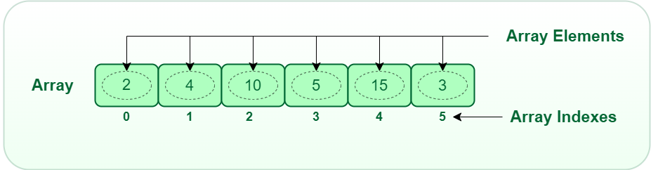

# Arrays

One variable holds one value. An array is a row of numbered lockers, all holding the same type, sharing one name. For example, we can use an array to store a day's temperature readings, one after another.

<div style="text-align: center;">
    
</div>

```cpp
int marks[5] = {88, 72, 95, 60, 41};
```

| Locker number | 0 | 1 | 2 | 3 | 4 |
| --- | --- | --- | --- | --- | --- |
| Value | 88 | 72 | 95 | 60 | 41 |

Counting starts at 0, not 1. In an array of 5 items the first is `marks[0]` and the last is `marks[4]`.

```cpp
cout << marks[0];   // 88
cout << marks[4];   // 41
marks[2] = 97;      // change one locker
```

The number in the brackets can itself be a variable, which is what makes arrays and loops such a natural pair.

```cpp
#include <iostream>
using namespace std;

int main() {
    int marks[5] = {88, 72, 95, 60, 41};
    int total = 0;
    for (int i = 0; i < 5; i++) {
        total += marks[i];
    }
    cout << "Average: " << total / 5.0 << endl;
}
```

**Output:**

```
Average: 71.2
```

We wrote `5.0`, not `5`, so the answer keeps its decimals (remember the integer division trap from [Variables](Variables.md)).

Notice `i < 5`, never `i <= 5`. Locker 5 does not exist, and C++ will not stop you from looking inside it: you get whatever junk sits in that memory, or the program crashes. This is the single most common array bug.

Searching through an array follows the same shape. Keep a best-so-far and compare.

```cpp
int highest = marks[0];
for (int i = 1; i < 5; i++) {
    if (marks[i] > highest) {
        highest = marks[i];
    }
}
cout << "Highest: " << highest << endl;   // Highest: 95
```

## Using a constant for the size

The size is fixed when you declare the array and cannot grow later. Write it once as a constant and use that everywhere, so there is only one place to change:

```cpp
const int SIZE = 5;
int marks[SIZE] = {88, 72, 95, 60, 41};

for (int i = 0; i < SIZE; i++) {
    cout << marks[i] << " ";
}
```

## Passing an array to a function

A function does not know how long an array is, so pass the size along with it. Write `[]` after the parameter name.

```cpp
#include <iostream>
using namespace std;

int sum(int values[], int size) {
    int total = 0;
    for (int i = 0; i < size; i++) {
        total += values[i];
    }
    return total;
}

int main() {
    int marks[5] = {88, 72, 95, 60, 41};
    cout << "Sum: " << sum(marks, 5) << endl;
}
```

**Output:**

```
Sum: 356
```

One thing to know: the function gets the *original* array, not a copy. If the function changes `values[0]`, then `marks[0]` changes too.

## Highlight: reading the bot's sensors

This is exactly what your robot will do. The bot has an array of 5 sensors, side by side under its front. Each one gives `1` if it sees the line and `0` if it doesn't. Put the readings in an array, and put a matching array of *weights* beside it, where each weight says where that sensor sits: negative is left of center, 0 is the middle, positive is right.

| Sensor | S0 | S1 | S2 | S3 | S4 |
| --- | --- | --- | --- | --- | --- |
| Weight | -2 | -1 | 0 | 1 | 2 |
| Reading (example) | 0 | 0 | 1 | 1 | 0 |

Here the line is under S2 and S3, so it is slightly to the right of center. To get one number for "where is the line?", average the weights of the sensors that see it:

```cpp
#include <iostream>
using namespace std;

const int SENSORS = 5;

int main() {
    int readings[SENSORS] = {0, 0, 1, 1, 0};
    int weights[SENSORS]  = {-2, -1, 0, 1, 2};

    int sum = 0;
    int count = 0;
    for (int i = 0; i < SENSORS; i++) {
        if (readings[i] == 1) {
            sum += weights[i];
            count++;
        }
    }

    if (count > 0) {
        double position = (double)sum / count;
        cout << "Line position: " << position << endl;
    } else {
        cout << "No line seen!" << endl;
    }
}
```

**Output:**

```
Line position: 0.5
```

A position of `0.5` means "a little to the right of center". The `(double)` makes the division keep its decimals, and the `count > 0` check stops us dividing by zero when no sensor sees the line. You will use this same idea in [Putting It Together](../Introduction%20to%20robotics/Putting%20It%20Together.md) to calculate the bot's error.

> 💡 **Try it yourself** — run the sensor program in the [Programiz online compiler](https://www.programiz.com/cpp-programming/online-compiler/) and change `readings` to see the position move. Try `{1, 0, 0, 0, 0}`, `{0, 0, 1, 0, 0}` and `{0, 0, 0, 0, 0}`. Then store 6 daily temperatures, work out the average, and print how many days were warmer than average. As a last experiment, deliberately read `marks[5]` on a 5-item array and see what junk value comes back.

## Quick reference

| Concept | Syntax | One-line reminder |
| --- | --- | --- |
| Array | `int a[5];` | first is `a[0]`, last is `a[4]` |
| Pass to function | `int f(int a[], int size)` | pass the size too |

**Next up:** [Putting it Together](PuttingItTogether.md)
