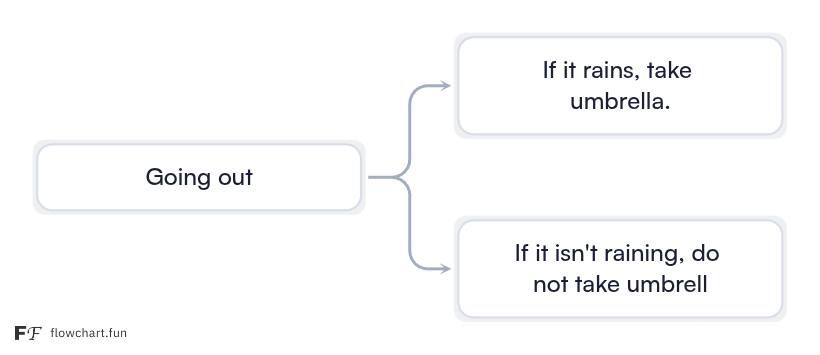

# If-Else

In programming we often need our program to make decisions based on a situation. For example, think about deciding whether to carry an umbrella.

You might think: "If it's raining, I'll take it. If it isn't, I won't."

<div style="text-align: center;">
    
</div>


Similarly, `if` asks a yes/no question and runs a block of code only when the answer is yes and `else` covers every other case.

```cpp
#include <iostream>
using namespace std;
int main(){
    int marks = 72;

    if (marks >= 40) {
        cout << "Pass" << endl;
    } else {
        cout << "Fail" << endl;
    }
}
```

**Output:**

```
Pass
```

The question inside the brackets is built with comparison operators.

| Operator | Means | With `marks = 72` |
| --- | --- | --- |
| `==` | is equal to | `marks == 72` is true |
| `!=` | is not equal to | `marks != 40` is true |
| `>` | is greater than | `marks > 90` is false |
| `<` | is less than | `marks < 90` is true |
| `>=` | is at least | `marks >= 72` is true |
| `<=` | is at most | `marks <= 71` is false |

The single `=` assigns a value, the double `==` compares. Writing `if (marks = 40)` quietly changes the marks to 40 instead of checking them.

When there are several possible answers, chain them with `else if`. The checks run top to bottom and stop at the first true one, so the order matters.

```cpp
#include <iostream>
using namespace std;

int main(){
    int marks = 82;
    if (marks >= 90) {
        cout << "Grade A" << endl;
    } else if (marks >= 75) {
        cout << "Grade B" << endl;
    } else if (marks >= 60) {
        cout << "Grade C" << endl;
    } else if (marks >= 40) {
        cout << "Grade D" << endl;
    } else {
        cout << "Needs improvement" << endl;
    }
}
```

**Output** (with `marks = 82`):

```
Grade B
```

Join two questions with `&&` (both must be true), `||` (either one is enough) or `!` (flip the answer).

```cpp
#include <iostream>
#include <string>
using namespace std;
int main(){

    int age = 16;
    string day = "Saturday";
    if (age >= 13 && age <= 19) {
        cout << "Teenager" << endl;
    }

    if (day == "Saturday" || day == "Sunday") {
        cout << "Holiday" << endl;
    }
}
```

**Output:**

```
Teenager
Holiday
```

> 💡 **Try it yourself** — change `marks` in the grade checker and run every branch in the [Programiz online compiler](https://www.programiz.com/cpp-programming/online-compiler/): test marks of 95, 80, 65, 45 and 20. Then write a new program that reads a number and prints whether it is positive, negative or zero. For a challenge, read three numbers and print the largest.

## Quick reference

| Concept | Syntax | One-line reminder |
| --- | --- | --- |
| Decision | `if (x > 0) { } else { }` | `==` compares, `=` assigns |

**Next up:** [Loops](Loops.md)
