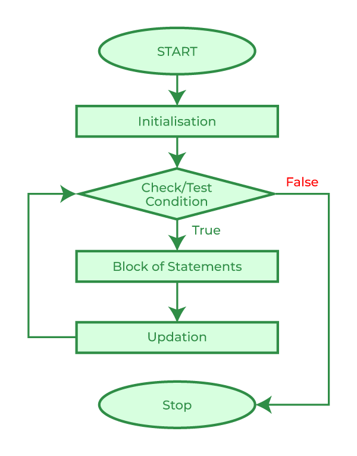
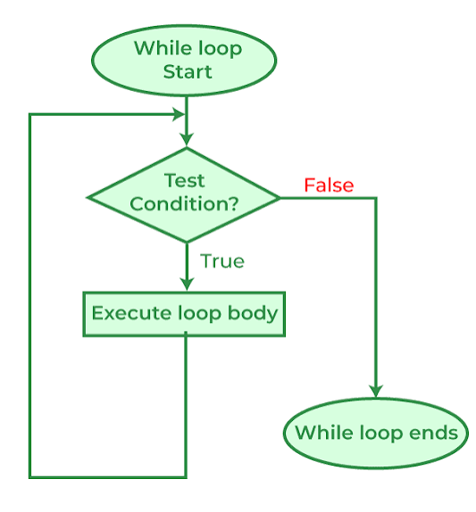
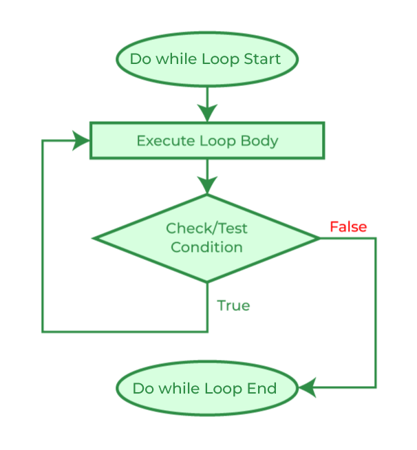

# Loops

Say you need to run the same instruction many times. The obvious way is to write it out again and again. That is tedious, and if the instruction changes you have to fix it on every single line. A loop avoids this: it repeats a block of code so you don't have to copy it out ten times.

C++ gives you three types of loops, and they differ only in when the question gets asked.

| Loop | Use it when | Runs at least once? |
| --- | --- | --- |
| `for` | you know how many rounds | no |
| `while` | you repeat until something changes | no |
| `do-while` | the body must run before you can decide | yes |

### for loop

<div style="text-align: center;">
    
</div>


```cpp
#include <iostream>
using namespace std;
int main(){
    for (int i = 1; i <= 5; i++) {
        cout << i << " ";
    }
}
```

**Output:**

```
1 2 3 4 5
```

The bracket holds three parts, separated by semicolons: the start (`int i = 1`), the test made before every round (`i <= 5`), and the step taken after every round (`i++`, meaning add 1 to `i`). Trace it on paper once and it stops being mysterious.

### while loop

<div style="text-align: center;">
    
</div>


```cpp
#include <iostream>
using namespace std;

int main(){
    int total = 0, n;
    cout << "Enter numbers, -1 to stop: ";
    cin >> n;

    while (n != -1) {
        total += n;
        cin >> n;
    }
    cout << "Total: " << total << endl;
}
```

**Sample run** (the user types `4 6 10 -1`):

```
Enter numbers, -1 to stop: 4 6 10 -1
Total: 20
```
- Keeps going while something is still true, like waiting at a bus stop until the bus actually arrives.
- You don't know how many rounds it'll take, only the condition that has to break for it to stop.

### do-while

<div style="text-align: center;">
    
</div>

```cpp
#include <iostream>
using namespace std;

int main(){
    int choice;
    do {
        cout << "Pick a number from 1 to 3: ";
        cin >> choice;
    } while (choice < 1 || choice > 3);
}
```

**Sample run:**

```
Pick a number from 1 to 3: 7
Pick a number from 1 to 3: 0
Pick a number from 1 to 3: 2
```

The question prints once before anything is checked, so the user is always asked at least once. It keeps asking until the answer is valid.

### break and continue

What if you want to stop a loop early, or skip one round? That's where the `break` and `continue` statements come in. `break` leaves the loop at once. `continue` skips the rest of this round and starts the next one.

```cpp
#include <iostream>
using namespace std;

int main(){
    for (int i = 1; i <= 10; i++) {
        if (i % 2 == 0) continue;   // skip even numbers
        if (i > 7) break;           // stop early
        cout << i << " ";
    }
}
```

**Output:**

```
1 3 5 7
```

Trace it: `2`, `4` and `6` are skipped by `continue`. At `i = 9`, the number is odd but greater than 7, so `break` ends the loop.

If a loop never ends, the test never became false. The usual cause is a forgotten `i++` or a `while` whose variable is never updated inside the body. Press Ctrl+C to stop a runaway program.

> 💡 **Try it yourself** — read a number and print its multiplication table up to 10, as `7 x 3 = 21`. Then write a loop that adds the numbers 1 to 100. Run both in the [Programiz online compiler](https://www.programiz.com/cpp-programming/online-compiler/). Finally, break a loop on purpose by removing the `i++` and see what a runaway loop looks like (Ctrl+C to stop it).

## Quick reference

| Concept | Syntax | One-line reminder |
| --- | --- | --- |
| Counting loop | `for (int i = 0; i < n; i++)` | start, test, step |
| Waiting loop | `while (condition) { }` | something inside must change |

**Next up:** [Functions](Functions.md)
