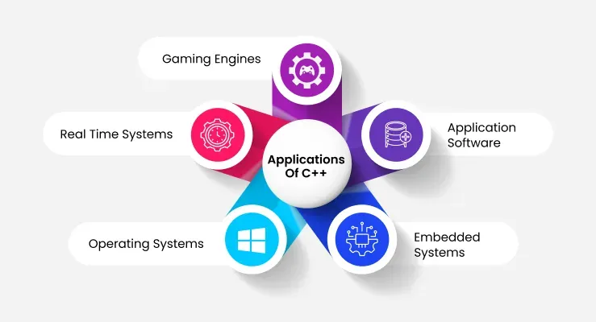

# C++

## What is C++?
C++ (pronounced "see plus plus") was developed by Bjarne Stroustrup at Bell Labs as an extension to C. Think of it like a language we use to talk with the robot you write instructions in C++ and it's converted into a language robot understands.

You've probably used something built with it without realizing:
- The last video game you played, most game engines are written in C++, because it has to happen instantly, thousands of times a second.
- Your car , the computer that controls the AC, music player,engine and airbags runs C++.
- Robots you've seen online, from robot vacuum cleaners to Mars rovers.
- Big chunks of Windows and Android are C++ under the hood.

Different job, same language  and soon, your robot too.

> 💡 **Try it now** — you don't need to install anything yet. Open [Programiz's online C++ compiler](https://www.programiz.com/cpp-programming/online-compiler/) in another tab and keep it open while you read — you'll use it for every code example from here on.

## Why C++?

So there are hundreds of languages we can use to talk with hardware, but there's a reason why we use C++ in particular. Your Arduino isn't a laptop , it doesn't have gigabytes of memory or a fast processor to spare, so the language talking to it has to be lean and direct. That's exactly what C++ gives us:

- **Faster execution** : no waiting around. When your sensor sees the line drifting, the motor needs to correct *now*, not half a second later.
- **Lower memory consumption** : your Arduino has a few kilobytes of memory, not the gigabytes your phone has. C++ doesn't waste it.
- **Direct memory access** : C++ lets you reach in and flip the exact switch you want, instead of asking someone else to do it for you. That's what lets your code talk straight to a motor pin.
- **Wide community support** : it's one of the most-used languages in robotics, so when you get stuck, chances are someone else already hit the same wall and posted the fix.

## C++ tutorial
- [Start the tutorial series →](HelloWorld.md)

### More on Cpp
1. [C++ for beginners - Learn C++ in one hour - Programming with mosh](https://www.youtube.com/watch?v=ZzaPdXTrSb8)
2. [If you're familiar with programming languages refer this for syntax](https://learnxinyminutes.com/c++/)
3. [More tutorials by w3 schools](https://www.w3schools.com/cpp/default.asp)
4. [Use this website to practice C++ online](https://www.programiz.com/cpp-programming/online-compiler/)
