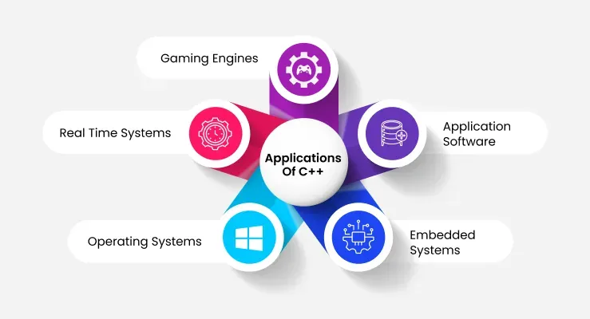

# C++

## What is C++?
C++ (pronounced "see plus plus") was developed by Bjarne Stroustrup at Bell Labs as an extension to C. Think of it as the language we use to talk to the robot. You write instructions in C++, and a program called a *compiler* converts them into the 1s and 0s the robot understands.

You've probably used something built with it without realizing:
- The last video game you played: most game engines are written in C++, because things have to happen instantly, thousands of times a second.
- Your car: the computers that control the AC, music player, engine and airbags often run C++.
- Robots you've seen online, from robot vacuum cleaners to Mars rovers.
- Big chunks of Windows and Android are C++ under the hood.

Different job, same language — and soon, your robot too.

> 💡 **Try it now** — you don't need to install anything yet. Open [Programiz's online C++ compiler](https://www.programiz.com/cpp-programming/online-compiler/) in another tab and keep it open while you read — you'll use it for every code example from here on.

## Why C++?
So there are hundreds of languages we can use to talk with hardware, but there's a reason why we use C++ in particular. Your Arduino microcontroller (a tiny computer on one chip) isn't a laptop — it doesn't have gigabytes of memory or a fast processor to spare, so the language talking to it has to be lean and direct. That's exactly what C++ gives us:

- **Faster execution** — no waiting around. When your sensor sees the line drifting, the motor needs to correct *now*, not half a second later.
- **Lower memory use** — your Arduino has a few kilobytes of memory, not the gigabytes your phone has. C++ doesn't waste it.
- **Close to the hardware** — C++ lets you control the exact pin you want, such as the one wired to a motor, without a lot of extra layers in between.
- **Wide community support** — it's one of the most-used languages in robotics, so when you get stuck, chances are someone else already hit the same wall and posted the fix.

## C++ tutorial
- [Start the tutorial series](HelloWorld.md)

### More on C++
1. [C++ for beginners: Learn C++ in one hour (Programming with Mosh)](https://www.youtube.com/watch?v=ZzaPdXTrSb8)
2. [Already know another language? Use this for C++ syntax](https://learnxinyminutes.com/c++/)
3. [More tutorials by W3Schools](https://www.w3schools.com/cpp/default.asp)
4. [Practice C++ online](https://www.programiz.com/cpp-programming/online-compiler/)
