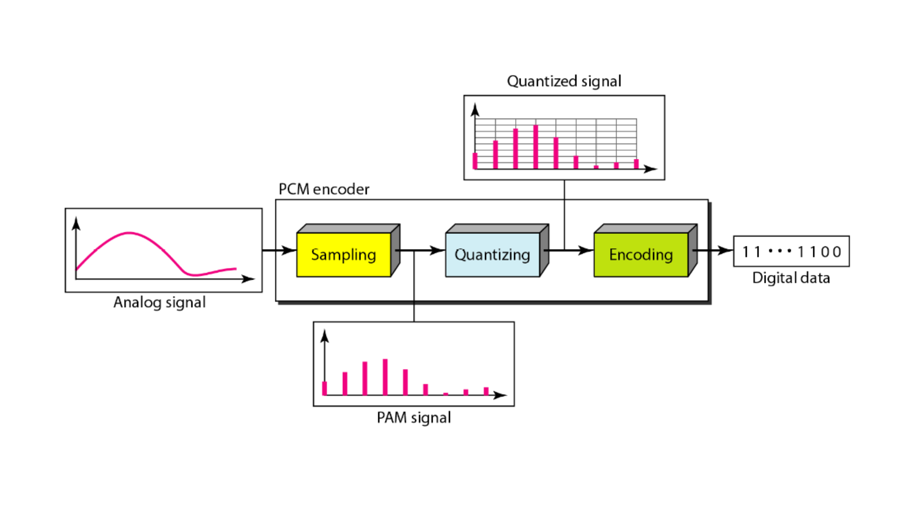
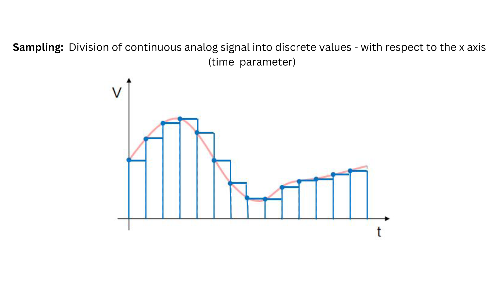
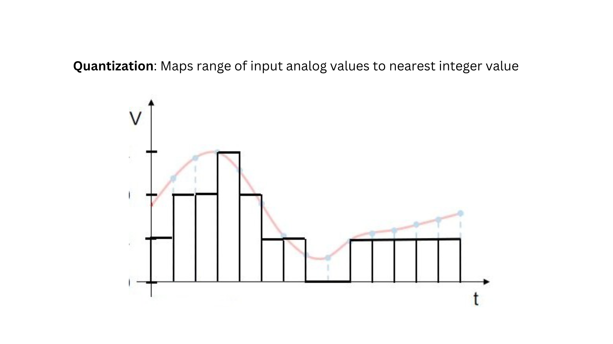
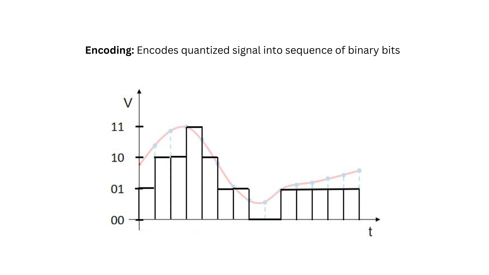

## Analog to Digital conversion

    

Analog-to-Digital Conversion (ADC) is a process that translates analog signals, which represent continuous variations in physical quantities, into digital signals composed of discrete values.

This conversion is essential for interfacing real-world signals with digital systems.

## Need for ADC in Electronics

    

**Compatibility with Digital Systems:**

Digital devices, such as computers and microcontrollers, operate using discrete values and binary code. Analog signals, which are continuous and vary smoothly and are usually obtained through sensors, need to be converted into a digital format for these devices to understand and process the information.

**Processing and Analysis:**

Once in digital form, signals can be processed, manipulated, and analyzed more efficiently. This is crucial for applications like signal processing, data analysis, and control systems where precise numerical information is required.

**Signal Transmission:**

Digital signals are less susceptible to noise and interference compared to analog signals. Therefore, converting analog signals to digital before transmission over long distances helps maintain signal integrity.

## ANALOG DIGITAL CONVERTER
An Analog-to-Digital Converter (ADC) is an electronic device or circuit that converts analog signals into digital signals. The primary function of an ADC is to take continuous, varying analog signals and transform them into discrete digital values, typically represented in binary form (0s and 1s).

This conversion is essential for interfacing analog signals with digital systems, such as microcontrollers, computers, and digital signal processors.

### Process of Analog digital converter

    

The process of Analog-to-Digital Conversion (ADC) involves several key stages: sampling, quantization, and encoding. Let's delve into each of these steps:

**Sampling:**

    

- Sampling is the process of capturing discrete samples or snapshots of an analog signal at regular intervals.
- The ADC periodically measures the amplitude of the analog signal at specific points in time.
- Sampling transforms the continuous analog signal into a series of discrete values, which can be processed and represented digitally.

**Quantization:**

    

- Quantization is the assignment of numerical values to each sampled point, mapping the analog signal to a finite set of discrete levels.
- The continuous range of sampled values is divided into distinct steps or levels. Each sample is then assigned a value corresponding to the level it falls within.
- Quantization reduces the infinite possibilities of the analog signal to a manageable set of discrete values, allowing for efficient representation in a digital system.

**Encoding:**

    

- Encoding involves representing the quantized values in a digital format, typically using binary code.
- The assigned numerical values are translated into binary, where each binary pattern represents a specific quantized level.
- Encoding prepares the data for storage, transmission, or further digital processing. The resulting digital signal consists of binary digits (bits) that can be easily processed and manipulated by digital systems.