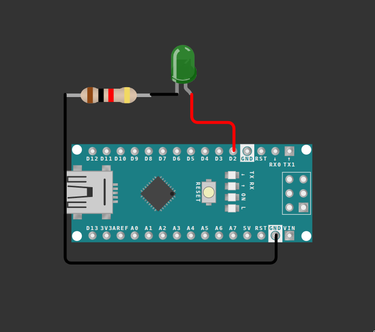

Hello tinkerers, now we know all we need to know to get our hands on the simulator.

First we'll start with something simple: turning on an LED on command.

> Note: for all simulations we'll be using [Wokwi](https://wokwi.com/projects/new/arduino-nano), an online simulator for the Arduino Nano, so even if we mess up the connection we won't accidentally damage a real Arduino board. New to Wokwi? Check out the [Wokwi walkthrough](index.md) first.

So an LED has only two states, either on or off, so it's a digital device. As we've seen in [Basics of Microcontrollers](../Basics%20of%20Microcontrollers/Arduino%20nano.md), there are separate digital and analog pins, and we can turn them on and off at will using Arduino programming.

As we know, an LED has an anode and a cathode. We'll connect the anode to the positive side and the cathode to the negative side.

Connect the anode to any digital pin on the Arduino Nano, and the cathode to the ground pin, but not directly — we route it through a resistor first, just like in the [Resistors](../../Introductions%20to%20Electronics/Basic%20components%20of%20Electric%20circuits/resistors.md) page. Without it, the LED would draw more current than it can safely handle.

>Note the pins starting with D are digital pins and pins starting with A are analog pins, and the number next to the letter represents the pin number.

Use the below image as a reference — notice the resistor sitting between the LED and the ground pin.

<div style="text-align:center;">
    
</div>

Now let's get into the coding part. As we've seen in [Structure of Arduino Programming](../Arduino%20Programming/Structure.md), inside `setup()` we define the pin mode, and inside `loop()` we write the logic. The `delay()` function holds a state for some milliseconds — here it sets the LED HIGH (on) for 1000 milliseconds (that's 1 second), then LOW (off) for another 1000 milliseconds.

```cpp
void setup() {
  pinMode(2, OUTPUT); // Since LED is an output device
}

void loop() {
  digitalWrite(2, HIGH);
  delay(1000);
  digitalWrite(2,LOW);
  delay(1000);

}

```


Now I'd suggest trying multiple LEDs, or changing the delay intervals.

**Next up:** [RGB LED](RGBLED.md)