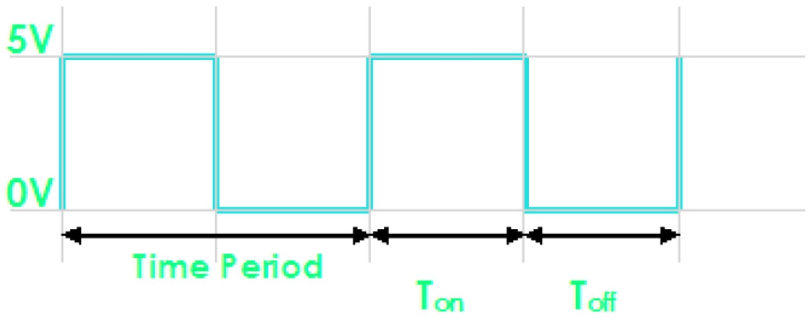
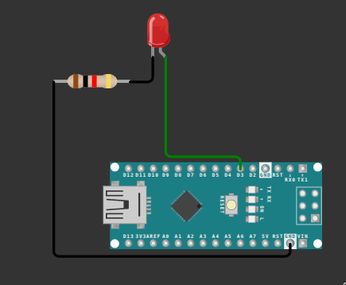

## Pulse Width Modulation (PWM)
<div style="text-align:center;">
    
</div>

- PWM stands for Pulse Width Modulation, a technique used to control the analog components by utilizing digital waveforms.

- PWM is employed to control the intensity or speed of devices like LEDs, DC motors, or servo motors, allowing for precise adjustments in brightness, speed, or position.

- PWM utilizes digital square wave signals, where the duration of the signal's ON state (high voltage) and OFF state (low voltage) is modulated to achieve the desired effect.

- On the Arduino Nano, specific pins are designated for PWM, namely pins 3, 5, 6, 9, 10, and 11. These PWM pins are identifiable by the symbol ~ next to their pin number on the Arduino board.

## Important terms in pulse width modulation

<div style="text-align:center;">
    
</div>

- The PWM signal is characterized by its duty cycle, which represents the ratio of ON time to the total time of one cycle. Adjusting the duty cycle allows control over the average power delivered to the load, affecting its behavior.
- The signal remains "ON" for some time and "OFF" for some time.

    - Ton = Time the output remains high.

    - Toff = Time the output remains Low.

    - When output is high the voltage is 5V

    - When output is low the voltage is 0V

    - Time Period(T) = Ton + Toff

    - Duty Cycle = Ton*100/(Ton + Toff)

    - Duty Cycle = 50% (in the above given signal)

The PWM pins on the Arduino Nano facilitate the generation of PWM signals through software, making it easy for developers to integrate precise control into their projects.

<div style="text-align:center;">
    
</div>

```cpp
void setup() {
  pinMode(3, OUTPUT);
}

void loop() {
  for (int brightness = 0; brightness <= 255; brightness++) {
    analogWrite(3, brightness);
    delay(10);
  }

  for (int brightness = 255; brightness >= 0; brightness--) {
    analogWrite(3, brightness);
    delay(10);
  }
}
```

> 💡 **Try it.** Replace the LED with a buzzer and listen to how the pitch changes as the duty cycle sweeps up and down.

## Quick reference

| Concept | Syntax | One-line reminder |
| --- | --- | --- |
| PWM output | `analogWrite(pin, 0-255);` | only works on `~` marked pins |
| Duty cycle | `Ton × 100 / (Ton + Toff)` | % of time the signal is HIGH |

**Next up:** [Analog Digital Conversion (ADC)](ADC.md)