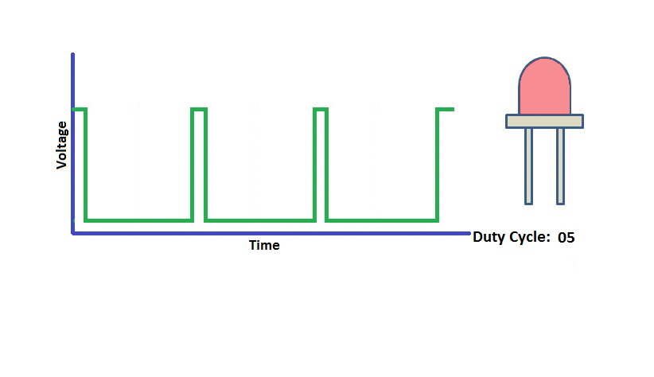
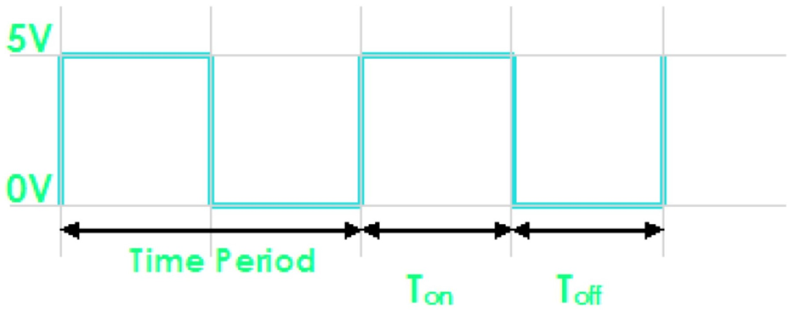
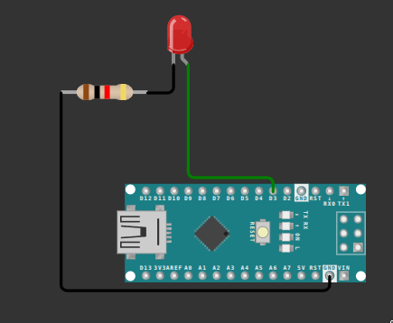

## Pulse Width Modulation (PWM)
<div style="text-align:center;">
    
</div>

- PWM stands for Pulse Width Modulation, a technique that lets a digital pin control analog-like things (such as brightness or speed) by switching quickly between ON and OFF.

- PWM is employed to control the intensity or speed of devices like LEDs, DC motors, or servo motors, allowing you to adjust brightness, speed, or position.

- PWM utilizes digital square wave signals, where the time spent ON (high voltage) compared to OFF (low voltage) is changed to get the effect you want. The switching is so fast that an LED looks dimmer, or a motor looks slower, instead of flickering.

- On the Arduino Nano (and Uno), only some pins can do PWM: **3, 5, 6, 9, 10 and 11**. They are marked with a `~` symbol next to the pin number on the board.

- The PWM signal repeats about **490 times per second (490 Hz)**. Pins 5 and 6 are faster, at about 980 Hz.

## Important terms in pulse width modulation

<div style="text-align:center;">
    
</div>

- The PWM signal is characterized by its duty cycle, which represents the ratio of ON time to the total time of one cycle. Adjusting the duty cycle allows control over the average power delivered to the load, affecting its behavior.
- The signal remains "ON" for some time and "OFF" for some time.

    - Ton = Time the output remains high.

    - Toff = Time the output remains Low.

    - When output is high the voltage is 5V

    - When output is low the voltage is 0V

    - Time Period(T) = Ton + Toff

    - Duty Cycle = Ton*100/(Ton + Toff)

    - Duty Cycle = 50% (in the above given signal)

The PWM signal is made by **hardware timers** inside the ATmega328P chip, not by your code. Once you call `analogWrite()`, the timer keeps the signal going on its own while your program does other things.

### Using `analogWrite()`

`analogWrite(pin, value)` takes a value from 0 to 255:

| Value | Duty cycle | Meaning |
| --- | --- | --- |
| 0 | 0% | always OFF |
| 127 (about half of 255) | about 50% | half the time ON |
| 255 | 100% | always ON |

In the example below, the LED fades in and out on pin 3. Notice the `delay(10)`, which makes the fade slow enough to see.

<div style="text-align:center;">
    
</div>

```cpp
void setup() {
  pinMode(3, OUTPUT);
}

void loop() {
  for (int brightness = 0; brightness <= 255; brightness++) {
    analogWrite(3, brightness);
    delay(10);
  }

  for (int brightness = 255; brightness >= 0; brightness--) {
    analogWrite(3, brightness);
    delay(10);
  }
}
```

>**Try it.** Change the `delay(10)` to a bigger or smaller number and see how the fade speed changes. Then try a different `~` pin, such as 5 or 6. Later, you will use the same `analogWrite()` idea to set the **speed of a motor**.

> Note: `analogWrite()` changes how long the pin stays ON, not how fast it switches. So it will not change the pitch of a buzzer.

## Quick reference

| Concept | Syntax | One-line reminder |
| --- | --- | --- |
| PWM output | `analogWrite(pin, 0-255);` | only works on `~` marked pins; 255 = 100% |
| Duty cycle | `Ton × 100 / (Ton + Toff)` | % of time the signal is HIGH |

**Next up:** [Analog Digital Conversion (ADC)](ADC.md)