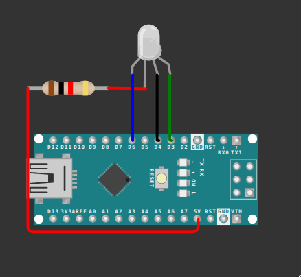

This RGB LED is in a common anode configuration, meaning it has one shared positive leg (the longer one) and three separate negative legs, one per colour. Connect the longer anode leg to the 5V pin through a resistor, and the three shorter cathode legs to digital pins.

Since the anode is fixed HIGH at 5V, a colour only lights up when its cathode pin is brought LOW — that's what completes the circuit and lets current flow. Setting a cathode pin HIGH keeps that colour off, since there's no longer any voltage difference across it.

Use the image below for reference.

<div style="text-align:center;">
    
</div>

```cpp
void setup() {
  pinMode(3, OUTPUT);
  pinMode(4, OUTPUT);
  pinMode(6, OUTPUT);
}

void loop() {
  digitalWrite(3, HIGH);
  digitalWrite(4, HIGH);
  digitalWrite(6, LOW);
  delay(1000);
  digitalWrite(3, HIGH);
  digitalWrite(4, LOW);
  digitalWrite(6, HIGH);
  delay(1000);
  digitalWrite(3, LOW);
  digitalWrite(4, HIGH);
  digitalWrite(6, HIGH);
  delay(1000);
}
```

Only one resistor is used here since just one colour is ever lit at a time. If you later light two or three colours together to mix colours, each cathode pin should get its own resistor — sharing one resistor across multiple simultaneously-lit colours makes their brightness balance unpredictable.

**Next up:** [Switch](switch.md)