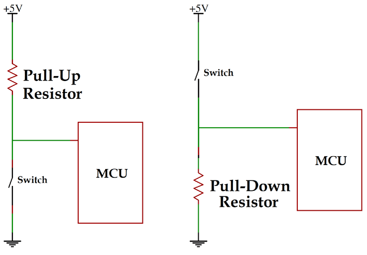
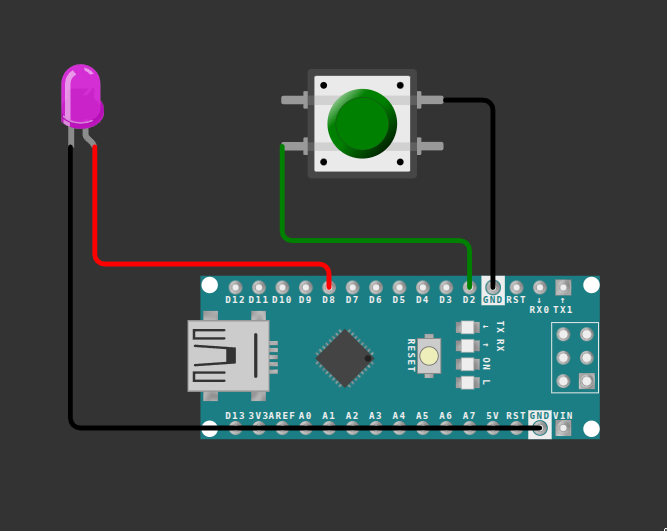

## SWITCH / PUSH BUTTON
A switch is a simple yet essential electrical or electronic device used to control the flow of electric current in a circuit. It's designed to either allow or interrupt the electrical connection between two or more conducting points within the circuit.

<div style="text-align:center;">
    
</div>

**Pull-Up Resistor:**

- In a pull-up configuration, the resistor is connected between the input pin of a microcontroller or other device and the VCC (power supply) line.

- When the switch is open (not pressed), the resistor pulls the voltage at the input pin to VCC, ensuring a HIGH state.

- When the switch is pressed, it provides a low-resistance path to ground, pulling the voltage at the input pin to a LOW state.

**Pull-Down Resistor:**

- In a pull-down configuration, the resistor is connected between the input pin and the ground (GND).

- When the switch is open, the resistor pulls the voltage at the input pin to GND, ensuring a LOW state.

- When the switch is pressed, it provides a low-resistance path to VCC, pulling the voltage at the input pin to a HIGH state.

These resistors prevent the input pin from floating (undefined state) when the switch is open, ensuring reliable and predictable behaviour in digital circuits. The choice between pull-up and pull-down configurations depends on the specific requirements of the circuit and the desired default state when the switch is not active.

Now look at the reference image:

<div style="text-align:center;">
    
</div>

The button is an input, and when it's pushed it connects the pin straight to GND. That's why we use the internal pull-up resistor (`INPUT_PULLUP`) — it means the pin always reads HIGH (1) when the button is not pushed, and reads LOW (0) when it is pushed.

We use `digitalRead()` to read the button's current value, and use that to control the LED.

The code below is a **starting point**, not the final answer — right now it makes the LED turn on while the button is *pressed*.

> 💡 **Try it.** Change the code so the LED glows when the button is *not* pressed, and turns off while it's being pressed. (Hint: you only need to swap what happens inside the `if` and `else`.)

```cpp
void setup() {
  pinMode(2, INPUT_PULLUP);
  pinMode(8, OUTPUT);
}

void loop() {
  int value = digitalRead(2);
  if (value == 0) {
    digitalWrite(8, HIGH);
  } else {
    digitalWrite(8, LOW);
  }
}
```

**Next up:** [Serial Communication](Serial%20communication.md)