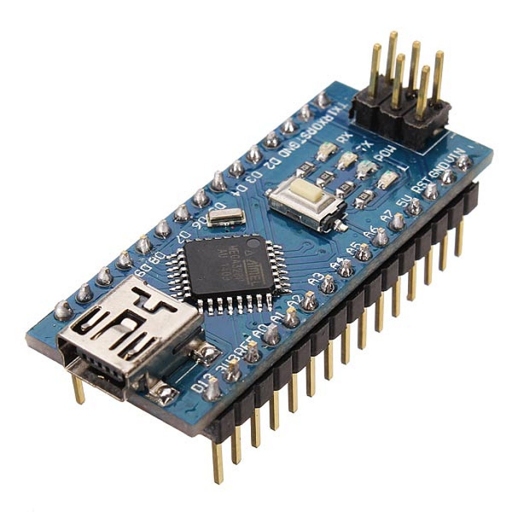

## Arduino Nano

    

* The Arduino Nano is a compact, breadboard friendly microcontroller board that offers almost all the capabilities of the Arduino Uno in a much smaller form factor (about 18 mm × 45 mm).
* Like the Uno, it is built around the **ATmega328P** microcontroller chip, so code written for the Uno generally runs on the Nano without any changes.
* It has a total of **30 header pins**, including **22 I/O pins** (14 digital + 8 analog). Of these, **20 can be used as general purpose digital I/O**, since A6 and A7 are analog input only.
* Its small size and pin headers let it plug directly into a breadboard, making it ideal for prototyping, wearables, robotics and space constrained projects.
* As an 8-bit microcontroller running at 16 MHz, the Nano processes data in 8-bit chunks and is well-suited for a wide range of sensing and control tasks.
* It offers **2 more analog inputs** than the Uno (A0 to A7 instead of A0 to A5).
* A **Mini-B USB** connector is used for both programming and power, so no external power supply is needed during development. Unlike the Uno, the Nano has **no DC barrel jack**.

## Pin Description of Arduino Nano

* **Microcontroller:** The brain of the board. It executes your program and controls the input and output devices. [ATmega328P]
* **Digital Pins:** Configured as either HIGH or LOW, allowing you to interface with digital sensors, LEDs, switches and other devices. [D0 to D13 - 14 digital pins]
  * **Note:** D0 and D1 are shared with the USB serial connection (RX and TX). Avoid using them for LEDs or sensors while you are uploading code or using the Serial Monitor.
* **Analog Pins:** Read analog voltage signals from analog sensors like temperature sensors, potentiometers, LDRs, microphones etc. [A0 to A7 - 8 analog pins]
  * A0 to A5 can also be used as digital I/O pins.
  * A6 and A7 are **analog input only**.
* **Power Supply Pins:** Pins for supplying or taking power [VIN, 5V, 3V3, GND].
* **Mini-B USB Connector:** Connects to a computer to upload (flash) the program, for Serial Communication, and to power the board.
* **PWM Pins:** 6 digital pins, marked by the ~ sign [D3, D5, D6, D9, D10, D11]. They produce analog like output by varying the width of the pulse, used for controlling LED brightness, motor speed, servo position etc.
* **USB-to-Serial Chip:** Manages communication between the microcontroller and the computer. Original boards use the **FT232RL**; many clone boards use the **CH340** (which may need a separate driver).
* **Reset Button:** Restarts the program running on the microcontroller.
* **Crystal Oscillator:** Provides the clock signal 16 MHz [precise timing].
* **Voltage Regulator:** Converts the VIN supply to a stable 5V for the microcontroller and other components.
* **ICSP Header:** 6-pin header for In Circuit Serial Programming, used to burn the bootloader or program the chip directly.
* **LEDs:**
  * **Power LED** - indicates the board is powered.
  * **TX/RX LEDs** - indicate data transmission over the serial interface.
  * **Built-in LED (L)** - connected to pin D13, useful for testing (e.g. the Blink sketch).

## Technical Specifications

| Parameter | Value |
|---|---|
| Microcontroller | ATmega328P (8-bit AVR) |
| Operating Voltage | 5V |
| Input Voltage (VIN, recommended) | 7-12V |
| Clock Speed | 16 MHz |
| Digital I/O Pins | 14 (D0 to D13) |
| PWM Pins | 6 (D3, D5, D6, D9, D10, D11) |
| Analog Input Pins | 8 (A0 to A7) |
| DC Current per I/O Pin | 20 mA recommended (40 mA absolute max) |
| Flash Memory | 32 KB (2 KB used by bootloader) |
| SRAM | 2 KB |
| EEPROM | 1 KB |
| USB Connector | Mini-B USB |
| Dimensions | 18 mm × 45 mm |
| Weight | ~7 g |

### Pin Summary

| Category | Pins | Count |
|---|---|---|
| Digital I/O | D0 to D13 | 14 |
| PWM | D3, D5, D6, D9, D10, D11 | 6 |
| Analog Input | A0 to A7 | 8 |
| UART | D0 (RX), D1 (TX) | 2 |
| I2C | A4 (SDA), A5 (SCL) | 2 |
| SPI | D10 (SS), D11 (MOSI), D12 (MISO), D13 (SCK) | 4 |
| External Interrupts | D2, D3 | 2 |
| Power | VIN, 5V, 3V3, GND × 2 | 5 |
| Control | RESET × 2, AREF | 3 |
| **Total header pins** | | **30** |
