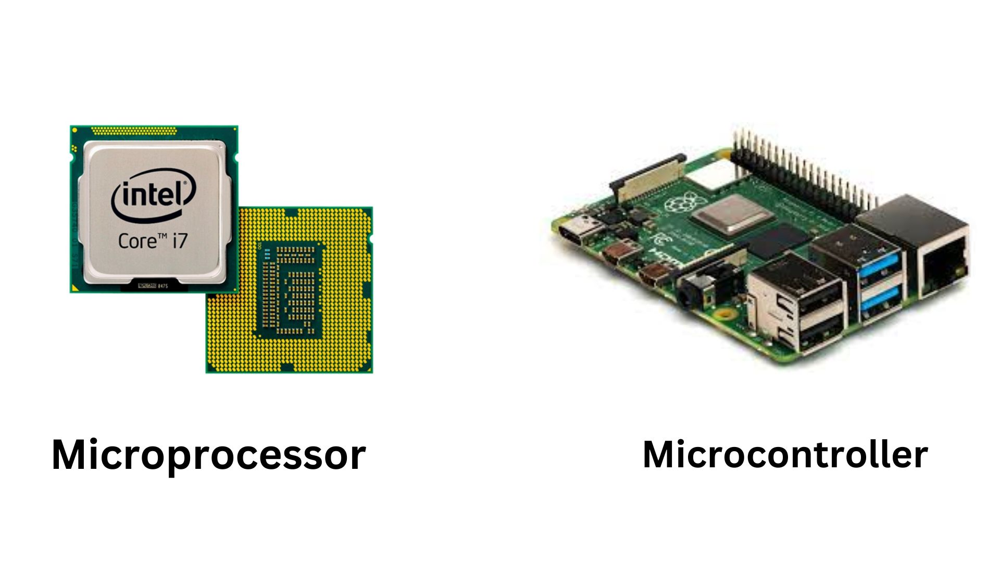

## What is a Microcontroller?
Imagine you have a tiny, super- smart computer that can do specific tasks all on its own. That's kind of what a microcontroller is! It's like a mini-computer that's designed to do one job really well.

Think of it as a brain for simple electronic devices. Just like your brain tells your body what to do, a microcontroller tells things like toys, microwave ovens, remote controls, and even some traffic lights what to do.

**Microcontrollers are made up of three main parts:**

- Central Processing Unit (CPU): This is like the thinking part of the microcontroller. It takes instructions and performs calculations, just like how you solve math problems.

- Memory: This is like the microcontroller's memory bank. It stores all the information it needs to do its job. Imagine if you had a notebook where you wrote down all the steps to complete a task - that's what the memory does for the microcontroller.

- Input/Output Pins: These are like the microcontroller's senses and hands. They let the microcontroller connect to the outside world. It can receive signals from sensors (like a thermometer telling it how hot it is) and send out signals to control things (like making a fan spin faster or slower).

## Different Types of Microcontrollers
They come in various shapes, sizes, and capabilities, and they're designed for different kinds of tasks.Some commonly used examples are:

- **Arduino:** Arduino microcontrollers are very beginner-friendly. They're used for all sorts of projects, from simple LED lights to complex robots. They have a huge community of users and plenty of tutorials and resources available.

- **Raspberry Pi:** Although often called a single-board computer, the Raspberry Pi can also be thought of as a powerful microcontroller. It's capable of running a full operating system like a computer, but it's still used for many projects where a microcontroller would be used.

- **ARM Microcontrollers:** The ARM architecture is used in a wide range of microcontrollers, from low-power devices to high-performance ones. Many smartphones, tablets, and other gadgets use ARM-based microcontrollers.

- **ESP8266 and ESP32:** These are popular for Internet of Things (IoT) projects. They have built-in Wi-Fi capabilities, making it easy to connect devices to the internet.

- **STM32 Microcontrollers:** These are widely used in a variety of applications, including automotive, industrial automation, and consumer electronics.

- **AVR Microcontrollers:** These are used in various applications, including household appliances, automotive systems, and more. They are known for their simplicity and efficiency.

- **8051 Microcontrollers:** These have been around for a long time and are still used in many embedded systems due to their simplicity and low power consumption.

## Difference between a Microcontroller and a Microprocessor
Microcontrollers are compact chips with integrated processors, memory, and peripherals designed for specific tasks in embedded systems, offering low power and cost.
Whereas,microprocessors are more powerful, general-purpose CPUs used in computers, requiring external components and suitable for diverse software applications.

    

The below table helps us to differentiate both based on a few important factors:

    

