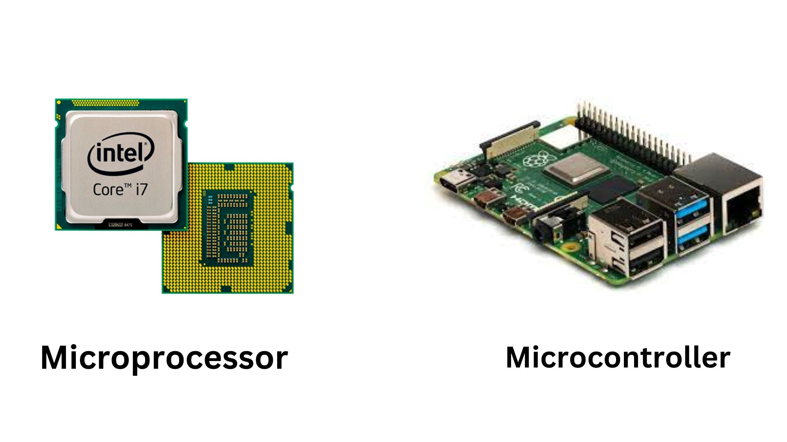

## What is a Microcontroller?
Imagine you have a tiny, super-smart computer that can do specific tasks all on its own. That's kind of what a microcontroller is! It's like a mini-computer that's designed to do one job really well.

Think of it as a brain for simple electronic devices. Just like your brain tells your body what to do, a microcontroller tells things like toys, microwave ovens, remote controls, and even some traffic lights what to do.

**Microcontrollers are made up of three main parts:**

- Central Processing Unit (CPU): This is like the thinking part of the microcontroller. It takes instructions and performs calculations, just like how you solve math problems.

- Memory: This is like the microcontroller's memory bank. It stores all the information it needs to do its job. Imagine if you had a notebook where you wrote down all the steps to complete a task - that's what the memory does for the microcontroller.

- Input/Output Pins: These are like the microcontroller's senses and hands. They let the microcontroller connect to the outside world. It can receive signals from sensors (like a thermometer telling it how hot it is) and send out signals to control things (like making a fan spin faster or slower).

## Different Types of Microcontrollers
Microcontrollers come in many shapes, sizes and strengths, and each is designed for different kinds of tasks. Here are a few families you may hear about:

- **AVR (for example, the ATmega328P):** Simple, efficient and very beginner-friendly. This is the chip family used on most classic Arduino boards.

- **ESP8266 and ESP32:** Popular for Internet of Things (IoT) projects. They have built-in Wi-Fi, which makes it easy to connect devices to the internet.

- **STM32 and other ARM-based microcontrollers:** More powerful chips used in cars, factory machines and consumer electronics.

- **Raspberry Pi Pico:** A small, low-cost board built around a microcontroller chip (the RP2040), which you can program in C++ or MicroPython.

> **Heads-up:** Some popular boards are *not* microcontrollers. The **Raspberry Pi** (not the Pico) is a small, full computer on a single board. It is built around a microprocessor, runs an operating system like Linux, and is a "single-board computer". Likewise, the chips inside phones and tablets are ARM *application processors*, which are much bigger and more powerful than the ARM microcontrollers mentioned above.

### Arduino: a board, not a chip

**Arduino** is an open-source platform: a family of ready-made boards plus free software to program them. The microcontroller is the chip *on* the board. For example, the Arduino Uno and Arduino Nano both carry an **ATmega328P** chip. It has a huge community and plenty of tutorials, which makes it a great place to start.

**In this competition we use the Arduino Nano (ATmega328P).** You will meet it properly in the next pages.

## Difference between a Microcontroller and a Microprocessor
Microcontrollers are compact chips with integrated processors, memory, and peripherals designed for specific tasks in embedded systems, offering low power and cost.
Whereas, microprocessors are more powerful, general-purpose CPUs used in computers, requiring external components and suitable for diverse software applications.

    

The table below shows how the two differ on a few important factors:

    

## What's in this section?
Over the next pages we will:

1. Get to know the **Arduino** and the **Arduino Nano** board we will use.
2. Learn the basics of **Arduino programming**: how a sketch is structured and the words you will see often.
3. Practice **interfacing** with LEDs, switches, sensors, PWM and the Serial Monitor, using the free Velxio simulator.

**Next up:** [Arduino](Basics%20of%20Microcontrollers/Arduino.md)
