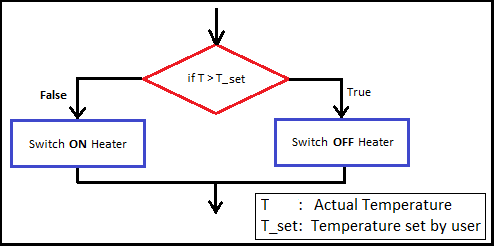
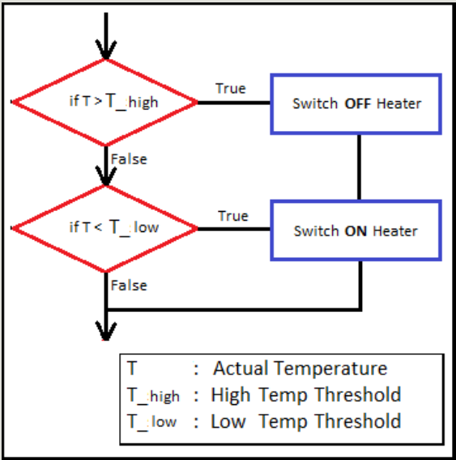
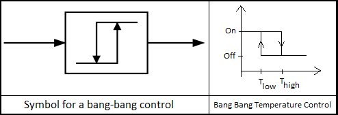

## Controller
**What is a Controller?**
A controller is something that alters the behaviour or state of the system in such a way that the behaviour or outcome must tend to a state that is desired. The following diagram shows what a controller is trying to achieve.

    

For ex.

Self-driving cars and robots in general don’t move with perfect precision. Their trajectory can be affected by their environment (such as non-flat surfaces), and slight mis-alignments in its mechanics (such as mis-aligned wheels).

A human driving a car with imprecisely aligned tyres can constantly self-correct to make sure they are driving straight. How can we teach a self-driving car to do the same?

## BANG BANG CONTROLLER
The controller that we shall write is something similar to what is popularly known as the "Bang Bang Controller". Well technically we might deviate a bit from what is strictly called Bang-Bang Controller but the idea is similar.

**Definition**
A bang–bang controller (2 step or on–off controller), is a feedback controller that switches abruptly between two states. - Wikipedia

We have all surely come across this controller in our daily life. If all the bold words made sense you will be able to guess some systems in your daily life that implement such a controller. Would you like to guess where this kind of controller is used in real life?

This is the controller that is used in water heater, thermostat etc.

*Question:* If you were to design a controller for a thermostat for a heater, how would you do it?

A possible algorithm you would come up with would be as shown in the flow chart below.

- IF temperature goes above set_temperature SWITCH OFF heater
- IF temperature goes below set_temperature SWITCH ON heater.

    

*Question:* Is there any flaw with this design?

What happens if the temperature is exactly equal to the set_temperature? In practice the heater would rapidly switch on and off and therefore this controller would damage the heater!

*Question:* So whats the solution?

We keep an allowance... We define T_high slightly higher than set_temperature and T_low slightly lower than set_temperature. And we modify the controller to the following flow chart:

- IF temperature goes above T_high SWITCH OFF heater
- IF temperature goes below T_low SWITCH ON heater.

    

This logic of a Bang Bang controller is shown in its symbol! The image on the left shows the symbol of Bang Bang Control, while the image on the right shows why it is so. The graph on the right shows the Temperature on x-axis and the control input sent to the heater is shown on the y-axis.

Also, do you see the "Bang Bang" happening in the graph!?

    

