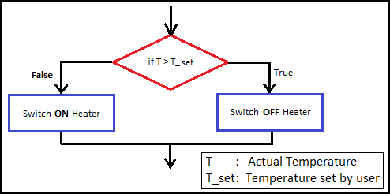
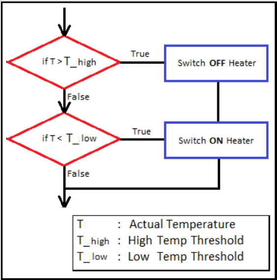
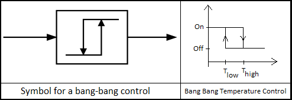

## Controller

**What is a Controller?**

A controller is something that adjusts a system so that its behaviour moves toward what we want. The following diagram shows what a controller is trying to achieve.

<div style="text-align:center;">
    
</div>

For example, self-driving cars and robots in general don't move with perfect precision. Their path can be affected by the environment (such as bumpy surfaces), and by small flaws in the mechanics (such as mis-aligned wheels).

A human driving a car with imprecisely aligned tyres can constantly self-correct to keep driving straight. How can we teach a robot to do the same?

## Bang-Bang Controller

The controller that we shall write first is similar to what is popularly known as the "Bang-Bang Controller". We might deviate a bit from the strict definition, but the idea is the same.

**Definition:** a bang-bang controller (also called a 2-step or on-off controller) is a feedback controller that switches abruptly between two states. (Wikipedia)

Two words in that definition need explaining:

- **Feedback controller:** a controller that *looks at the result* (using a sensor) and uses it to decide what to do next. Like steering a bike: you see you are drifting left, so you steer right.
- **Switches abruptly between two states:** there is nothing in between. It is fully ON or fully OFF.

We all meet this controller in daily life. Can you guess where it is used?

It is used in water heaters, room thermostats, irons, and so on.

*Question:* If you were to design a controller for the thermostat of a heater, how would you do it?

A possible algorithm you could come up with is shown in the flow chart below.

- IF temperature goes above set_temperature, SWITCH OFF the heater.
- IF temperature goes below set_temperature, SWITCH ON the heater.

<div style="text-align:center;">
    
</div>

*Question:* Is there any flaw with this design?

What happens if the temperature is right around the set_temperature? In practice the heater would rapidly switch on and off, many times a second, and this would damage the heater!

*Question:* So what's the solution?

We keep an allowance. We define T_high slightly higher than set_temperature and T_low slightly lower than set_temperature. Then we modify the controller as in the flow chart below:

- IF temperature goes above T_high, SWITCH OFF the heater.
- IF temperature goes below T_low, SWITCH ON the heater.
- Otherwise (in between), do nothing and keep the heater as it is.

<div style="text-align:center;">
    
</div>

This gap between T_low and T_high is called **hysteresis** (say "hiss-ter-EE-sis"). It means the controller's choice depends on what it was doing before, not just on the current reading. This stops the rapid flicking.

## Why It's Called "Bang-Bang"

The picture below shows the symbol for a bang-bang controller on the left, and a graph of the heater control on the right. The x-axis is the temperature, and the y-axis shows whether the heater is ON or OFF. The signal jumps between the two states, "bang" and then "bang" again!

<div style="text-align:center;">
    
</div>

## Bang-Bang for a Line Follower

Now connect this to our robot. The "temperature" is the line position, and the "heater" is the pair of motors. The sensors tell the bot which side the line is on, and it makes a fixed turn:

```
if the left sensors (S0, S1) see the line:
    turn left        // left motor slow, right motor fast
else if the right sensors (S3, S4) see the line:
    turn right       // left motor fast, right motor slow
else:
    go straight      // the "in between" zone, like the hysteresis gap
```

It works, but the bot only has the choices "turn hard" or "go straight". It never asks *how far* off the line it is, so it zig-zags. The next page shows how to fix that.
