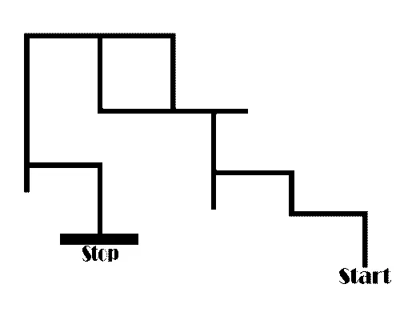
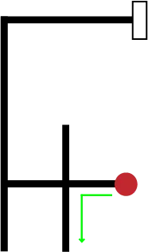
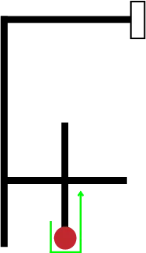
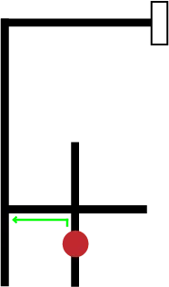
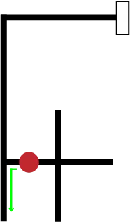
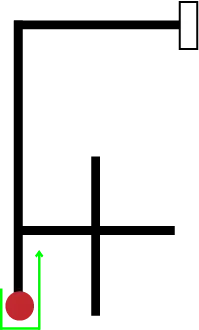
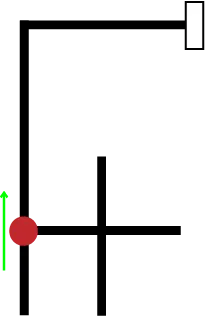

## When the Line Splits

So far, your bot's only job has been to stay on the line, and PID handles that beautifully. But a maze isn't one long line. Every so often, the line splits, turns, or simply ends, and your bot has to make a decision: *which way now?*

*Question:* Imagine you're walking through a maze and reach a spot where you can go left, straight, or right. How would you decide which way to go? And more importantly, how would you make sure you don't end up walking in circles forever?

## Junctions: What the Bot Actually Sees

Your IR sensor array can recognize a handful of different situations under the bot:

- **Straight line** — only the middle sensors see the line. Keep going, PID has this covered.
- **Left turn** — the line bends off to the left, and the left-side sensors light up.
- **Right turn** — same idea, on the right side.
- **T-junction** — the line branches both left and right at once.
- **Cross junction** — the line continues straight *and* branches left and right.
- **Dead end** — no sensors see the line at all. There's nowhere to go but back.

Recognizing *that* you're at a junction is only half the problem. The other half is deciding which path to take, and doing it the same way every single time.

## Priority Rules: LSRB and RSLB

    

The trick is to pick a fixed order of preference and always stick to it. The two most common orders are:

**LSRB — Left, Straight, Right, Back.** At every junction, check each direction in this exact order, and take the first one that's open:

1. Can I turn **Left**? If yes, turn left.
2. If not, can I go **Straight**? If yes, go straight.
3. If not, can I turn **Right**? If yes, turn right.
4. If none of those are open, it's a dead end, so turn around and go **Back**.

**RSLB — Right, Straight, Left, Back.** The exact same idea, mirrored: check Right first, then Straight, then Left, and only turn Back if nothing else is open.

*Question:* Why does it matter so much that the bot uses the same order every single time, instead of picking a direction at random?

Because a fixed order is exactly what guarantees the bot will eventually solve the maze. LSRB is really the "keep your left hand on the wall" trick people use in real mazes: if you always keep one hand on the same wall and never let go, you'll eventually trace your way out of any simple maze. RSLB is the same trick, just with your right hand. Pick randomly, and there's no such guarantee, your bot could wander the same loop forever.

## Walking Through an Example

Let's trace a real run through a maze, one decision at a time. Remember: Left, Straight and Right are always relative to the direction the bot is currently facing, not fixed compass directions.

    

**Decision 1.** The bot arrives at this junction heading west. Checking in LSRB order: is Left open? Yes, a path heads south from here, so it turns and heads down.

    

**Decision 2.** That path is a dead end, Left, Straight and Right are all blocked. The only option left is Back, so the bot does a U-turn and heads north again.

    

**Decision 3.** Back at the same junction, now heading north. Left (which is west from here) is open, so it turns and heads west.

    

**Decision 4.** At the next junction, still checking Left first: heading west, Left is south, and it's open. Down it goes again.

    

**Decision 5.** Another dead end. Just like before, Left, Straight and Right are all blocked, so it's Back again, turning to head north.

    

**Decision 6.** Back at that junction, heading north, and this time Straight is open. The bot carries straight on, no turn needed.

Six decisions, and notice the pattern: the bot never once guessed. At every junction it just worked through Left, then Straight, then Right, then Back, in that exact order, and whichever one was open first won.

## Turning Without Losing the Line

There's one last catch. When your bot makes a sharp turn at a junction, its sensors briefly lose sight of the line altogether, partway through the turn, nothing is underneath them. If the bot panics and treats that moment as a dead end, it'll spin around and head back the way it came.

The usual fix is to commit to the turn: once the bot decides to turn left (or right), keep turning until the middle sensors find the line again, and only *then* hand control back to the PID controller. PID handles the fine-grained "stay centered" job; LSRB/RSLB handles the bigger "which way at this junction" decision, each doing the job it's actually good at.

| Rule | Priority order | Real-world version |
| --- | --- | --- |
| LSRB | Left → Straight → Right → Back | keep your left hand on the wall |
| RSLB | Right → Straight → Left → Back | keep your right hand on the wall |

**Further reading:**
- [Pololu's line maze algorithm guide](https://www.pololu.com/file/0j195/line-maze-algorithm.pdf)
- [Coding a line follower robot using LSRB and finding the shortest path](https://towardinfinity.medium.com/coding-a-line-follower-robot-using-lsrb-and-finding-the-shortest-path-d906ffec71d)
