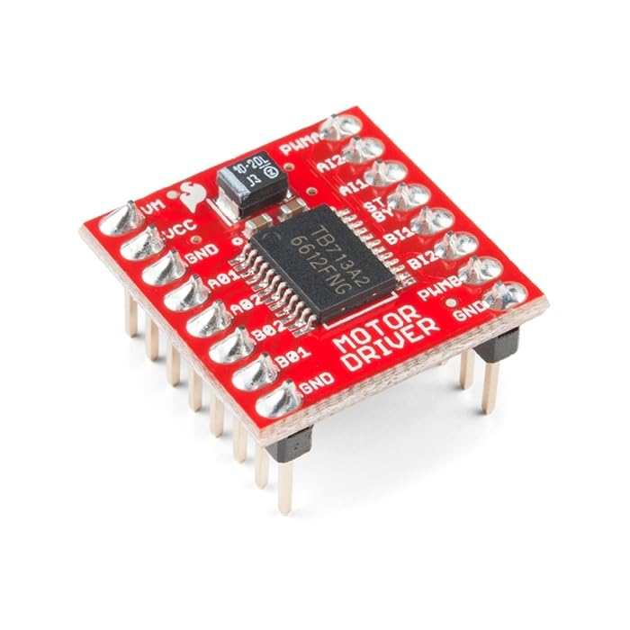

## MOTORS

A motor turns electrical energy into motion. It's the "muscle" of a robot. In the Sense-Think-Act loop, motors are how a robot **Acts**: once the controller has decided what to do, the motors carry it out.

## Types of Motors

### DC Motors (Brushed)

- The simplest and cheapest motor, and the most common one in beginner robot kits. **Our bot uses two of these.**
- It has just **two wires**. Connect them to a battery and the shaft spins.
- **Swap the two wires (reverse the polarity) and it spins the other way.**
- The harder you "push" it with electricity (higher voltage), the faster it spins.
- Inside, small contacts called "brushes" pass current to the spinning part. They wear out over time and make a little noise.

**Gear motors:** a DC motor on its own spins very fast but is weak. Most robots use a *gear motor*: a DC motor with a small gearbox attached. The gears slow the wheel down and make it stronger (more torque). The small yellow motors in many kits are gear motors.

### Brushless DC Motors (BLDC)

- Do the same job as a brushed motor, but use electronics instead of brushes.
- More efficient and longer lasting, but they need a special driver called an **ESC (Electronic Speed Controller)**. You'll find them in drones.

### Servo Motors

- Built to turn to a particular **angle** (for example "go to 90 degrees") and hold it, rather than spin continuously.
- Used for steering, grippers and robot arms.

### Stepper Motors

- Move in small, fixed "steps", so you can command an exact number of steps.
- Common in 3D printers.

| Motor type | Key trait | Common use |
| --- | --- | --- |
| DC (Brushed) | simple, cheap, 2 wires | basic robots, **our bot** |
| Brushless (BLDC) | efficient, needs an ESC | drones |
| Servo | turns to an exact angle | steering, grippers |
| Stepper | precise, repeatable steps | 3D printers |

## Why Motors Need a Driver

A microcontroller pin can only safely supply a tiny current (about 20 mA on an Arduino), but a small DC motor can need 500 mA or more. Plug a motor straight into a pin and, at best, nothing happens; at worst, you damage the pin.

A **motor driver** sits between the microcontroller and the motor. It takes small, safe signals from the microcontroller and uses them to switch a much larger current from a separate power source to the motor.

### The H-Bridge: How Direction Is Reversed

To reverse a DC motor, we need to swap which wire gets plus and which gets minus. An **H-bridge** does this with four switches arranged like the letter H, with the motor in the middle:

- Close the top-left and bottom-right switches: current flows one way, and the motor spins **forward**.
- Close the top-right and bottom-left switches: current flows the other way, and the motor spins **backward**.

    

A motor driver chip contains H-bridges, so the microcontroller never has to switch the big current itself.

## The TB6612FNG Motor Driver

    

The TB6612FNG is the driver we use. Key facts:

- It has **two channels** (A and B), so it can drive **two motors**, one for each wheel.
- Each channel has a **PWM pin** (PWMA / PWMB) to set the **speed**. PWM is a way of switching power on and off very fast; on Arduino, `analogWrite(pin, 0..255)` gives 0 (stopped) to 255 (full speed).
- Each channel has two **direction pins** (AIN1/AIN2 and BIN1/BIN2) to set the direction.
- **STBY** (standby) must be set HIGH to turn the driver on. If it's LOW, the motors are off.
- **VM** is the motor power supply, connected to the battery. **VCC** is the small logic supply (from the Arduino, 5 V).
- The driver, Arduino and battery must **share a common ground (GND)**.

Direction truth table for one channel (the PWM pin sets the speed in each case):

| IN1 | IN2 | Motor does |
| --- | --- | --- |
| HIGH | LOW | spins forward |
| LOW | HIGH | spins backward |
| LOW | LOW | stops (coasts) |
| HIGH | HIGH | brakes (stops quickly) |

Which of forward or backward is clockwise depends on how you wired the motor. If a wheel spins the wrong way, just swap its two motor wires.

Now that you know how to run one motor, see [Motion Control](motion%20control.md) to learn how two motors move the whole robot.
