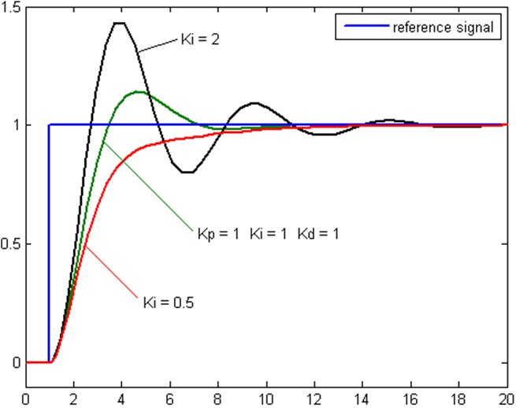

## From Bang-Bang to Something Smoother

The Bang-Bang controller from the last page works, but it has an obvious flaw: it only ever knows two states, full power ON or completely OFF. It never asks *how far off* you are, only *which side*.

*Question:* Picture your line-following bot drifting a little bit off the line versus drifting a lot off the line. With a Bang-Bang controller, both cases get exactly the same correction, a full turn one way or the other. Does that sound right to you?

That's the wobble you'll see if you try Bang-Bang on a real line follower: it lurches hard left, overshoots the line, lurches hard right, overshoots again. It never knew *how much* to correct by.

## The Big Picture

Here is the block diagram of a PID controller. Don't worry if it looks scary, the next sections explain each piece one at a time.

<div style="text-align:center;">
    
</div>

**Further reading:** [PID control video](https://youtu.be/wkfEZmsQqiA)

## The P (Proportional) Controller

The fix is simple to say: **make the correction proportional to how wrong you are.** A small drift gets a small nudge. A big drift gets a big correction. This is called a **P controller**, P for Proportional.

First we need a number for "how wrong". This is the **error**:

- `target` is where we want the line to be: exactly in the middle, which we call **0**.
- `current` is where the line really is, measured by the sensors (for example -2 = far left, +2 = far right, see [Putting It Together](Putting%20It%20Together.md)).

```
error = current - target
```

Since our target is 0, `error` is simply the measured line position. **Positive error means the line is to the right**, negative means to the left. (This is the same sign rule used on the Putting It Together page.)

The P controller turns that error into a correction:

```
correction = Kp * error
```

`Kp` is a number you choose yourself, called the **proportional gain**. It controls how strongly the bot reacts: turn `Kp` up and small drifts cause big corrections; turn it down and the bot barely reacts.

Then the correction is added to one wheel and taken from the other, so the bot turns **toward** the line:

```
leftMotorSpeed  = baseSpeed + correction
rightMotorSpeed = baseSpeed - correction
```

### A worked example

Let `baseSpeed = 150` and `Kp = 10`.

| Cycle | Line position (error) | correction = Kp x error | Left motor | Right motor | What happens |
| --- | --- | --- | --- | --- | --- |
| 1 | +2 (far right) | +20 | 170 | 130 | curves right, toward the line |
| 2 | +1 (a bit right) | +10 | 160 | 140 | still curving right, but gentler |
| 3 | 0 (centered) | 0 | 150 | 150 | goes straight |
| 4 | -1 (a bit left) | -10 | 140 | 160 | curves left, back to center |

See how the correction shrinks as the error shrinks? That is the "proportional" part.

*Question:* What do you think happens if `Kp` is set too high?

If `Kp` is too large, even a tiny error produces a huge correction, and the bot swings past the line, then swings back past it the other way. That's **overshoot**, and if it keeps happening you get oscillation (a wobble), smoother than Bang-Bang but still a wobble. If `Kp` is too low, the bot barely notices it's drifting and takes forever to correct.

## Adding D: Damping the Wobble

Even with a carefully tuned `Kp`, a plain P controller tends to overshoot, correct back, overshoot again, each swing a little smaller. That's because P only looks at the error *right now*. It can't tell "I'm about to reach the line, ease up" from "I'm still far away, keep going."

The **D (Derivative)** term looks at how fast the error is changing. In code, it is just the difference between this error and the last one:

```
derivative = error - previous_error     // runs once per loop, so each step is the same length of time
correction = Kp * error + Kd * derivative
previous_error = error                  // remember it for the next cycle
```

Continuing our example with `Kd = 5`. In cycle 1 the error was 2, and in cycle 2 it is 1:

- `derivative = 1 - 2 = -1` (the error is shrinking)
- `correction = 10 x 1 + 5 x (-1) = 5`

Without D the correction would be 10, now it is only 5. D is pulling back like a brake as the bot approaches the line. Think of easing off the accelerator as you see a red light ahead, instead of slamming the brakes at the last moment.

(The loop should run at a steady speed, so that "difference between two readings" always means the same amount of time.)

## Adding I: Erasing the Leftover Error

Sometimes a small, steady error refuses to go away, called **steady-state error**. For example, friction or a slightly weaker motor keeps the bot a little off-center. A tiny error gives a tiny `Kp * error` correction, too small to overcome the friction in the motors, so the bot just stays off-center.

The **I (Integral)** term fixes this by keeping a running total of the error:

```
integral = integral + error
correction = Kp * error + Ki * integral + Kd * derivative
```

Even a tiny error, if it hangs around long enough, keeps adding up until the I term pushes hard enough to erase it.

**Warning (windup):** if the bot is off the line for a long time, `integral` grows huge, and afterwards the bot overreacts for a long while. This is called *integral windup*. Limit it, for example with `integral = constrain(integral, -100, 100)`.

Because of this, most line followers use a very tiny `Ki`, or `Ki = 0` (which makes it a PD controller). That works well for most robots.

## PID: All Three Together

Put P, I, and D together and you get a **PID controller**, one of the most widely used control algorithms in the world, running everything from thermostats and cruise control to the line-following bot you're about to build.

| Term | Reacts to | Fixes |
| --- | --- | --- |
| P (Proportional) | how wrong you are right now | the basic correction |
| I (Integral) | how long you've been wrong | small errors that never go away |
| D (Derivative) | how fast the error is changing | overshoot and oscillation |

## How to Tune It

Tuning means finding the right `Kp`, `Ki`, and `Kd` for your specific bot. Follow this recipe:

1. Set `Ki = 0` and `Kd = 0`. Use a slow, safe `baseSpeed`.
2. Slowly raise `Kp` until the bot follows the line but starts to wobble from side to side.
3. Reduce `Kp` a little, until the wobble just stops.
4. Now raise `Kd` slowly until the bot follows the line smoothly, even on curves.
5. Only if the bot still sits slightly off-center, add a very small `Ki`.
6. Once it works, try a higher `baseSpeed` and tune again.

Change one number at a time, and write down what you tried. You'll practise this in the upcoming tasks.
