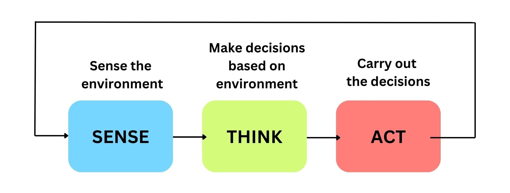

## SENSE-THINK-ACT

The "Sense-Think-Act" paradigm is a framework that describes the fundamental process by which robots interact with their environment. It can be broken down into three key stages:

    

**1. Sense:**
In this stage, robots gather information about their surroundings using various sensors.
These sensors could include cameras, touch sensors, gyroscopes, accelerometers, and more.
The goal is for the robot to perceive and understand its environment, collecting data on aspects such as distance, light, sound, and object recognition.
**2. Think:**
After sensing the environment, the robot processes and interprets the gathered data.
This involves using algorithms and computational power to make sense of the sensory input.
The robot's "thinking" stage includes tasks such as recognizing patterns, identifying objects, assessing the current situation, and making decisions based on its programming or learned behavior.
**3. Act:**
Once the robot has processed the information and made decisions, it takes action based on its understanding of the environment.
This could involve moving its physical components (motors, limbs, etc.) or initiating other activities.
The ultimate goal is for the robot to perform specific tasks or respond to its surroundings in an appropriate and effective manner.

This paradigm reflects the cyclical nature of robotic interaction with the world, where sensing informs thinking and thinking guides actions.

It is a foundational concept in robotics, influencing the design and programming of robots to enable them to operate autonomously or semi-autonomously in diverse environments.

