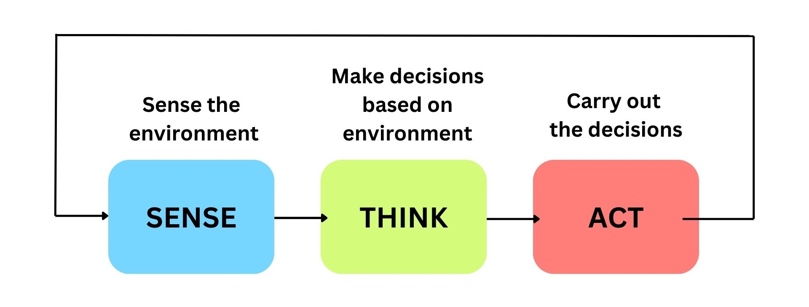

## SENSE-THINK-ACT

The "Sense-Think-Act" paradigm (a fancy word for "way of thinking") describes how a robot interacts with the world. It has three stages, repeated again and again:

    

**1. Sense**

- The robot gathers information about its surroundings using sensors.
- Sensors could be cameras, touch sensors, distance sensors and more.
- The goal is to measure things like distance, light or sound.

**2. Think**

- The robot processes the information it collected.
- It uses a program (an algorithm) running on its controller to understand the situation.
- Then it makes a decision based on its program.

**3. Act**

- The robot carries out the decision.
- This usually means moving something, like turning motors or wheels.

This is a loop: sensing informs thinking, and thinking guides acting. Then the robot senses again to see what its action changed.

## Example: Our Line Follower

- **Sense:** the IR sensors read the floor and say where the black line is.
- **Think:** the PID controller works out how much to steer, and LSRB decides which way to go at a junction.
- **Act:** the motors speed up or slow down, so the bot turns toward the line.

This happens hundreds of times every second!
