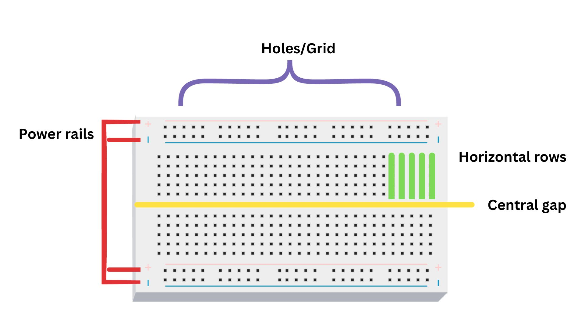

## BREADBOARD
A breadboard is an essential tool in electronics used for quickly and easily creating and testing electrical circuits. It consists of a grid of holes that allow components like resistors, LEDs, and wires to be inserted without soldering.

It's an ideal platform for experimentation, prototyping, and learning, as it enables components to be easily moved and rearranged, making it an excellent choice for beginners and professionals to design and test circuits.

Here are the different types of breadboards available to us. The size and type of breadboards are selected based on the user requirements and the application.

**Anatomy of a Breadboard**

    

**Power Rails:** These are rows usually marked as "+ (plus)" and "- (minus)" on the sides of the breadboard. They provide power for your circuit.

**Central Gap:** A break in the middle of the breadboard, which separates the two sides and ensures components on one side do not connect to those on the other side, unless shorted by a conducting wire or device.

**Holes/Grid:** The breadboard has a grid of small holes where components are inserted, making electrical connections.

**Horizontal Rows:** Rows of holes that run horizontally, connecting components placed in the same row electrically.

The combination of these elements allows you to quickly and easily prototype and experiment with electronic circuits without the need for soldering.
Components can be inserted into the holes, and wires are used to make connections between components by placing them in appropriate rows.

## Connections on a breadboard

**Horizontal Alignment**

    

**Vertical Alignment**

    

