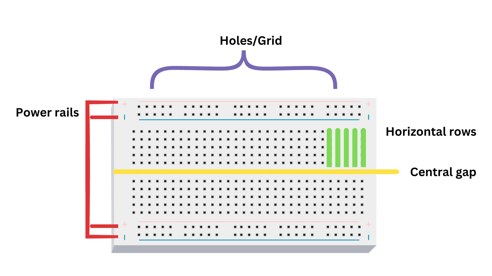

## Breadboard

A breadboard is an essential tool in electronics used for quickly and easily creating and testing electrical circuits. It consists of a grid of holes that allow components like resistors, LEDs, and wires to be inserted without soldering.

It's an ideal platform for experimentation, prototyping, and learning, as it enables components to be easily moved and rearranged, making it an excellent choice for beginners and professionals to design and test circuits.

Breadboards come in different sizes, from small ones with a few dozen holes to large ones with hundreds. Choose the size that fits your project. For our robot, a small or medium one is enough.

## Anatomy of a Breadboard

    

**Power rails:** These are the long strips usually marked "+" (red) and "-" (blue) along the sides of the breadboard. All the holes along one rail are connected, so they give you a handy place to connect power and ground.

**Central gap:** The channel in the middle of the breadboard. The two halves are not connected to each other. The gap is the right size for an IC (chip) to straddle it, so that the legs on opposite sides don't touch each other. You can connect the two halves with a wire or a component.

**Holes (grid):** The breadboard has a grid of small holes where components are inserted, making electrical connections.

**Rows:** In the main area, each short row of 5 holes (on each side of the gap) is connected inside. Components placed in the same group of 5 are connected electrically.

The combination of these elements allows you to quickly and easily prototype and experiment with electronic circuits without the need for soldering.
Components can be inserted into the holes, and wires are used to make connections between components by placing them in appropriate rows.

## Which Holes Are Connected?

- In the main area, the 5 holes in each short row are connected to each other, but not to the other rows and not across the central gap.
- On the power rails, all the holes along the long strip are connected.
- Some larger breadboards have a break in the middle of the power rails, so check yours with a wire if you are unsure.

**Horizontal alignment**

    

**Vertical alignment**

    

> **Try it:** Place an LED so that its two legs are in different rows. Connect a wire to one row and see which other holes are linked to it.
