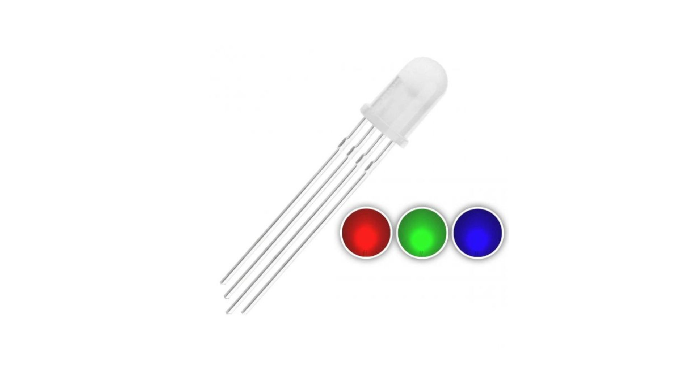
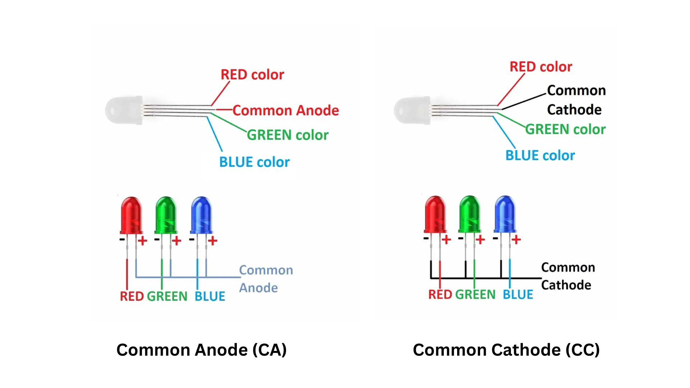

Have you ever pondered how electronic devices ensure electricity flows in one direction and prevent it from going the other way? Let's explore the world of diodes to unveil the secret behind this fascinating behavior! 
Diodes are essential electronic components that allow current to flow in one direction while blocking it in another. They are two-terminal devices with the primary function of controlling the direction of electric current. 

When a diode is in a circuit, it ensures that current can only flow from the anode to the cathode. This property plays a crucial role in rectifying alternating current (AC) into direct current (DC) and protecting circuits from reverse voltage. 

    

## Working: 
**Forward Bias:** When a diode is forward-biassed (positive voltage applied to the anode and negative to the cathode), it conducts current freely. Electrons move from the n-type (negative) region to the p-type (positive) region, creating a flow of electricity. 

**Reverse Bias:** In reverse bias (negative voltage applied to the anode and positive to the cathode), the diode acts as an insulator. Very little current flows as electrons are blocked from moving from the p-type to the n-type region.

For an easy understanding of the working of a diode. Kindly enjoy the following video:

    <iframe width="560" height="315"
        src="https://youtu.be/Fwj_d3uO5g8?si=2_pWOCfWWG1TfHkr"
        title="YouTube video"
        frameborder="0"
        allowfullscreen>
    </iframe>

## Purpose
**Rectification:** Diodes are used to convert alternating current (AC) into direct current (DC) by allowing current flow in one direction only.  

**Voltage Regulation:** Zener diodes maintain a constant voltage output across their terminals and are used in voltage regulation circuits.  

**Signal Clipping:** Diodes are employed to limit the amplitude of signals, preventing them from exceeding a certain level.

## Types of Diodes 
**Rectifier Diodes:** Used for converting AC to DC. Common types include silicon diodes and Schottky diodes. 

**Zener Diodes:** Designed for voltage regulation, maintaining a constant output voltage. 

**Light-emitting diodes (LEDs):** emit light when current flows through them; used in displays and indicators. 

**Schottky Diodes:** Fast-switching diodes with a low forward voltage drop are suitable for high-frequency applications.  

**Varactor Diodes:** Used in tuning circuits, their capacitance varies with the applied voltage. 

**Avalanche Diodes:** Designed to break down at a specified voltage, used in avalanche breakdown protection. 

Tunnel diodes exhibit a negative resistance region in their current-voltage characteristic and are used in microwave amplifiers and oscillators. 

## Application
Diodes have diverse applications.

- They're essential in power supplies for converting AC to stable DC, ensuring devices receive reliable power.
- In RF communication, they serve as mixers and detectors. Diodes protect circuits from reverse voltage and overloads.
- Light-emitting diodes (LEDs) are used in displays, while others control signal amplitudes in audio and video processing.

## Light-emitting diode 

    

- Light-emitting diodes, or LEDs, are semiconductor devices that emit light when an electric current passes through them. 
- LEDs are highly efficient and versatile light sources, offering several advantages over traditional incandescent and fluorescent lights: they are energy-efficient, durable, and have a long lifespan. 
- LEDs come in various colors, and their brightness can be easily controlled.
- They are commonly used in displays, indicators, lighting, and numerous applications, from smartphones and TVs to traffic signals and automotive lighting, contributing to energy savings and environmental sustainability.

## RGB LED

    

- An RGB LED is a combination of three LEDs: red, green, and blue. 
- Indeed, by varying the intensities of the three primary colours—red, green, and blue (RGB)—a wide spectrum of colours can be created. 
- That is, by switching the supply voltage to RGB LEDs, different colours are formed. 

RGB LEDs typically consist of three separate LED elements, each corresponding to one of the primary colours (red, green, and blue).

**Pin Configuration:**

**Common Pin:** connects to either ground (common cathode) or a positive voltage source (common anode).

**Red Pin:** controls the intensity of the red color.

**Green Pin:** controls the intensity of the green color.

**Blue Pin:** controls the intensity of the blue color.

    

An RGB LED has two types:

**1. Common Anode (CA):** Anode +ve/source pin is common

In a common anode configuration:

- The anodes (positive terminals) of multiple LEDs or segments in a display are internally connected to a common pin. 
- The cathodes (negative terminals) of each LED or segment have separate pins. 
**2. Common Cathode (CC):** Cathode -ve/Ground pin is common

In a common cathode configuration:

- The cathodes (negative terminals) of multiple LEDs or segments in a display are internally connected to a common pin. 
- The anodes (positive terminals) of each LED or segment have separate pins.