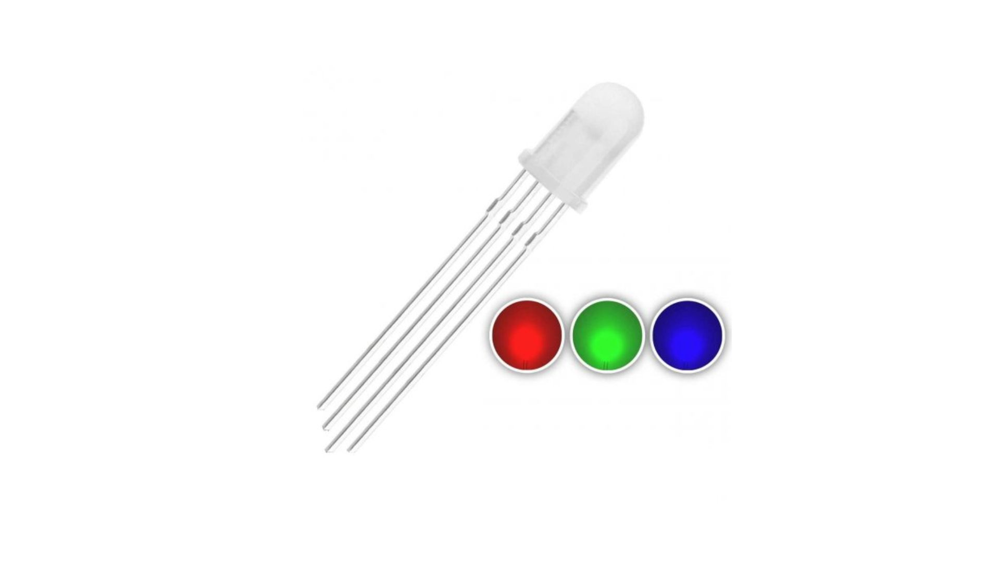
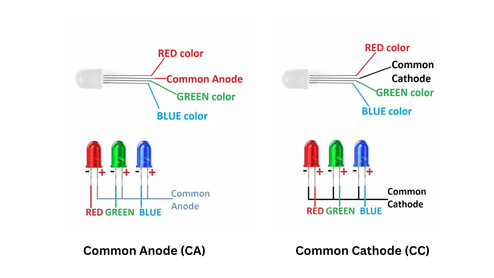

## Diodes

Have you ever wondered how electronic devices make sure electricity flows in only one direction? Let's explore diodes to find out!

A diode is a small component with two legs. It lets current flow in **one direction only** and blocks it in the other direction. Think of it as a one way street for electricity.

The two legs are called the **anode** (+) and the **cathode** (-). Current can only flow from the anode to the cathode. This is useful for protecting circuits from being connected the wrong way round. A diode can also turn the back and forth current from a wall socket (AC) into one way current (DC) that electronics can use. That job is called *rectifying*.

    

## Working

A diode is made by joining an n-type and a p-type semiconductor (see the Semiconductors page). This joint is called a **PN junction**.

**Forward bias:** When the positive side of a battery is connected to the anode and the negative side to the cathode, the diode conducts current easily.

**Reverse bias:** When the battery is connected the other way round, the diode blocks the current. Almost nothing flows.

For an easy understanding of how a diode works, enjoy the following video:

    <iframe width="560" height="315"
        src="https://www.youtube.com/embed/Fwj_d3uO5g8"
        title="YouTube video"
        frameborder="0"
        allowfullscreen>
    </iframe>

## Common Types of Diodes

**Rectifier and signal diodes:** Used to make current flow one way, for example in power supplies and for protecting circuits from reverse voltage.

**Zener diodes:** Special diodes that keep a steady, fixed voltage across them. They are used to keep a voltage from going too high.

**Light-emitting diodes (LEDs):** Diodes that give off light when current flows through them. We will look at these next.

## Light-Emitting Diode (LED)

    

- An LED is a diode that glows when current flows through it.
- LEDs are energy efficient, long lasting and come in many colors.
- You see them everywhere: indicator lights, TVs, torches and traffic signals.

**Things to remember when using an LED:**

- **Always use a series resistor.** An LED has almost no resistance of its own, so too much current will burn it out. A resistor of about **220 ohm** in series with the LED is a typical choice.
- **Polarity matters.** The **longer leg is the anode (+)** and the shorter leg is the cathode (-). Connect the anode towards the positive side.
- **Forward voltage drop is about 2 V.** An LED "uses up" roughly 2 V of the supply when it is glowing (it varies a little with color).

You will use exactly this setup (an LED with a 220 ohm resistor) in the LED lesson.

> **Try it:** Look closely at an LED. Can you spot which leg is longer? There is also a flat edge on the plastic body, which is on the cathode side.

## RGB LED

    

- An RGB LED is three LEDs in one package: red, green and blue.
- By changing how bright each of the three is, you can make almost any color.

**Pins of an RGB LED:**

- **Common pin:** connects to either ground (common cathode) or the positive supply (common anode).
- **Red pin:** controls the red color.
- **Green pin:** controls the green color.
- **Blue pin:** controls the blue color.

    

An RGB LED comes in two types:

**1. Common Anode (CA):** the anode (+) pin is shared.

- The anodes (positive legs) of the three LEDs are joined inside to one common pin.
- Each color has its own separate cathode (negative) pin.

**2. Common Cathode (CC):** the cathode (-) pin is shared.

- The cathodes (negative legs) of the three LEDs are joined inside to one common pin.
- Each color has its own separate anode (positive) pin.
