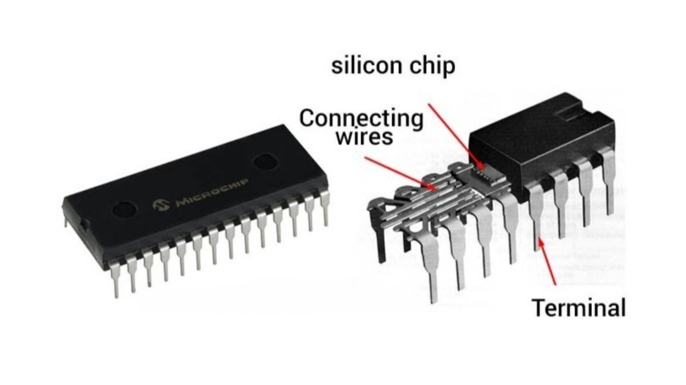

## Integrated Circuits (ICs):
- Integrated circuits, commonly known as ICs or microchips, are miniature electronic devices that contain a multitude of interconnected electronic components and transistors on a single semiconductor substrate, typically made of silicon. 
- These components are designed to perform various functions, such as amplification, signal processing, logic operations, and more.
- ICs come in a wide range of sizes and complexities, from small-scale digital logic gates to highly complex microprocessors. 
- They are used in nearly every electronic device, from smartphones and computers to household appliances and automotive systems.

    

## 555 TIMER IC 
Let us look at the 555 timer IC! 

The 555 timer IC is an integrated circuit used for applications such as timers, pulse generators, and oscillators.

- The 555 timer is an 8-pin device.
- It is available as both a through-hole component and a surface-mounted device. 

    

Pin configuration of 555 TIMER:

- GND (ground): This is the ground reference for the IC. 

- TRIG (Trigger): When the voltage at this pin falls below 1/3 of the supply voltage, the timer is triggered, i.e., the OUT pin goes high and the atiming interval starts. 

- OUT (output): It produces a square wave or pulse signal based on its operating mode that goes high or low. 

- RESET (Reset): When connected to the ground, it resets the timer and stops its operation. 

-CTRL (Control Voltage): This pin provides access to the internal voltage divider. 

- THRS (Threshold): The voltage at this pin is compared to the voltage at the TRIG pin. When it exceeds 2/3 of the supply voltage, the timer changes its state, i.e., the timing interval ends. 

- DISCH (Discharge): This pin is used to discharge the external capacitor between intervals. 

-  VCC (Supply Voltage): This pin is connected to the positive supply voltage.

## Embedded Systems:
- Embedded systems are specialised computer systems designed to perform dedicated functions or tasks within a larger system. 
- They typically consist of a microcontroller or microprocessor, memory, input/output interfaces, and software that is tailored for specific applications.
- Embedded systems can be found in a wide array of devices and systems, including consumer electronics (e.g., washing machines, microwave ovens), automotive control systems (e.g., engine control units), medical devices, industrial automation, and more.
- They are built to be reliable, efficient, and often operate in real-time, making them an integral part of modern technology.