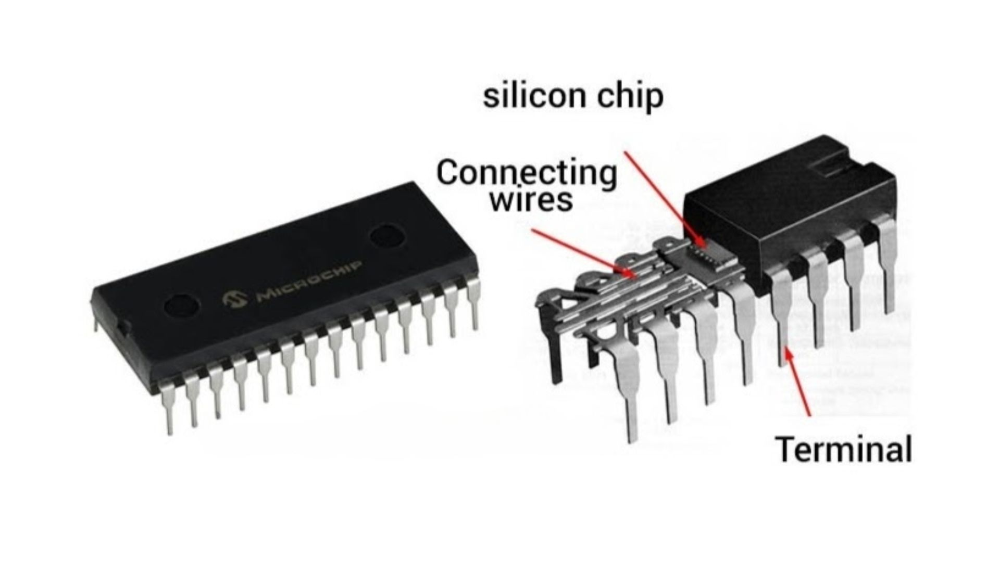

## Integrated Circuits (ICs)

An integrated circuit, or **IC** (also called a *chip* or *microchip*), is a tiny piece of silicon with thousands, millions or even billions of transistors and other parts packed onto it. All the parts are already wired together inside, so one small chip can do a big job.

- Some ICs are simple, like a chip that only makes basic yes/no decisions (logic gates).
- Some are very complex, like the processor in a phone or computer.
- ICs are found in almost every electronic device: phones, TVs, washing machines and cars.

**Example:** the "brain" of your Arduino board is an IC too. It is a chip called the **ATmega328P**, and it runs the program you upload.

    

## Embedded Systems

An embedded system is a small computer built into a device to do one specific job.

- It usually has a **microcontroller** (a tiny computer on a single chip), memory, input/output pins and a program written for its task.
- You already use embedded systems every day: in microwave ovens, washing machines, TV remotes and car engines.
- They are made to be reliable and to react quickly.

Your line-following robot is an embedded system too. The Arduino reads the sensors, decides what to do and tells the motors to move.

> **Try it:** Look around your home and list three devices that probably have a chip inside them.
