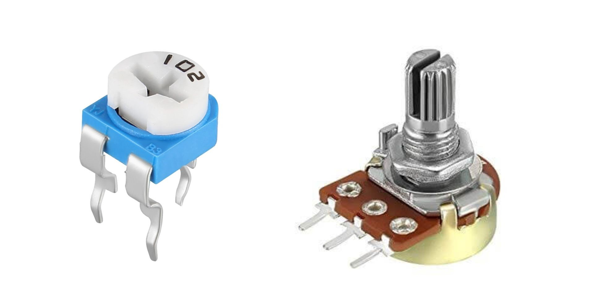
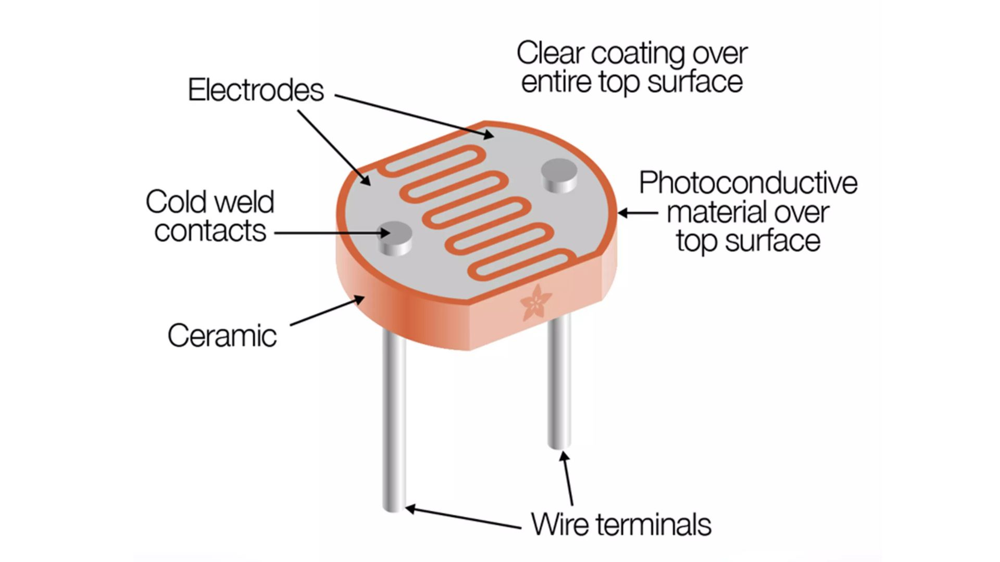

Have you ever thought about how your gadgets get just the right amount of electric power they need without getting overloaded? Let's dive into the world of resistors to find out the secret behind them!

Resistors are fundamental electronic components that are used to limit or control the flow of electric current in a circuit. They are passive two-terminal devices with the primary purpose of providing resistance to the flow of electrical current.

If a resistance is present in a circuit, some voltage is dropped on the resistor. The amount of dropped voltage is calculated by Ohm's law.

## Types of resistors: 
** Fixed Resistors:**

- These resistors have a stable, unchanging resistance value. - They maintain a consistent level of resistance and are commonly used when a specific resistance value is needed in a circuit.

**Variable Resistors (Potentiometers and Rheostats):**

- These are special resistors that can have their resistance adjusted or changed as required.
- Think of them like volume knobs on a radio—you can turn them to increase or decrease resistance, which is handy for tasks like adjusting brightness or volume in various electronic devices.
- Potentiometers are often used for finer adjustments, while rheostats handle higher-power applications. 

## Colour coding of resistors:
To indicate their resistance values, many resistors are colour-coded with bands of different lors. By interpreting these colour bands, you can determine the resistor's resistance value. Different color codes are used for different tolerance levels and precision.br>

**4-band color code of the resistor:** In a 4-band Band color code, the resistance of a resistor is printed throughfour color s strips on the resistor. Each colour has its own significance. 

    

Each colour has its own value (given in the below table); these values are placed in the following formula, and the value of resistance is determined. 1st, 2nd, and 3rd are the colour codes of the 1st, 2nd, and 3rd olors. The 4th determines the tolerance percentage of the resistor. 

Tolerance: Tolerance is a percentage variation that the resistor can have from its actual values. 

In 5 band and 6 band color codes additional 3rd digit is there rest of the things are same.

## Colours and their codes

    

## POTENTIOMETER

    <iframe width="560" height="315"
        src="https://youtu.be/sWbSeJmUFfw?si=68zhtDhJsoMwkBGF"
        title="YouTube video"
        frameborder="0"
        allowfullscreen>
    </iframe>

A potentiometer, often abbreviated as "pot," is a type of variable resistor used in electronics and electrical circuits. It is a three-terminal device with a resistive element and a sliding contact, and its primary function is to provide a variable voltage divider.

    

A potentiometer has three parts: a track, two fixed ends, and a moving slider.Turning a knob moves the slider, changing the resistance between the slider and one end while keeping the resistance between the slider and the other end constant. 

    

## LIGHT DEPENDENT RESISTOR - LDR

- LDR stands for "Light-Dependent Resistor" or "Light-Dependent Sensor."
- It is a passive electronic component that changes its resistance in response to the intensity of incident light. LDRs are also commonly known as photoresistors or photocells.

**Working of LDR:**
LDRs have a resistance that decreases as the amount of light they are exposed to increases. In other words, their resistance is high in dark or low-light conditions, and it decreases when exposed to bright light. 

**Applications of LDR:**
LDRs are versatile light-sensitive devices used for tasks like automatic outdoor lighting control, camera exposure adjustment, and DIY electronics projects. 

>Note that LDR does not have any polarity. 

    

