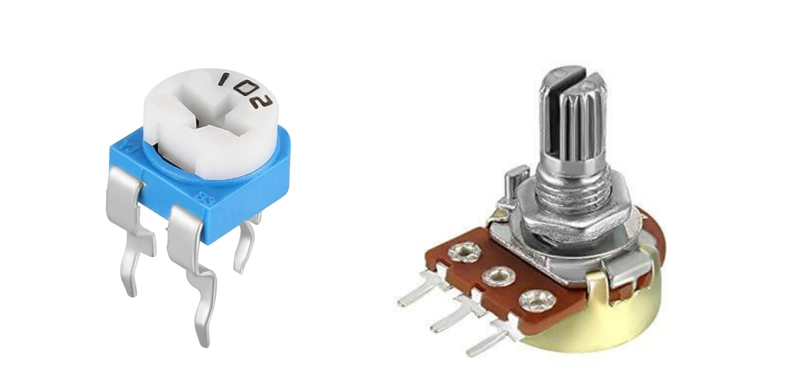
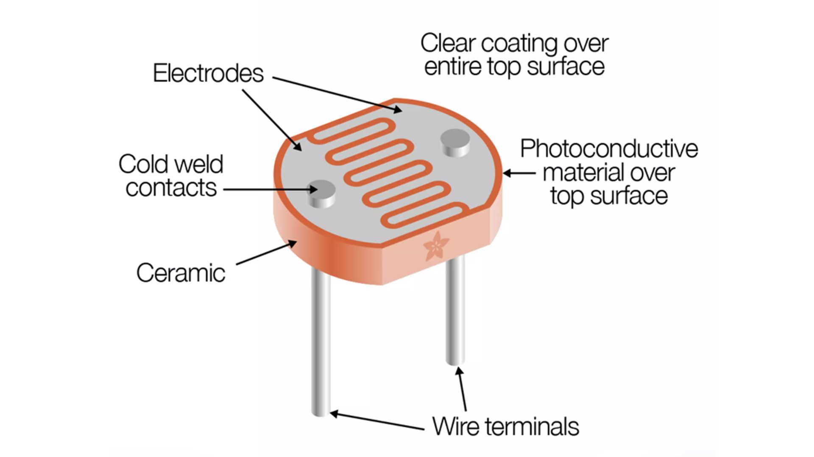

## Resistors
Have you ever thought about how your gadgets get just the right amount of electric power they need without getting overloaded? Let's dive into the world of resistors to find out the secret behind them!

Resistors are fundamental electronic components that are used to limit or control the flow of electric current in a circuit. They are passive two terminal devices with the primary purpose of providing resistance to the flow of electrical current.

If a resistance is present in a circuit, some voltage is dropped on the resistor. The amount of dropped voltage is calculated by Ohm's law.

## Types of Resistors
**Fixed Resistors:**

- These resistors have a stable, unchanging resistance value.
- They maintain a consistent level of resistance and are commonly used when a specific resistance value is needed in a circuit.

**Variable Resistors (Potentiometers and Rheostats):**

- These are special resistors that can have their resistance adjusted or changed as required.
- Think of them like the volume knob on a radio: you turn it to increase or decrease resistance, which is handy for adjusting brightness or volume.
- Potentiometers are often used for finer adjustments, while rheostats handle higher power applications. 

## Color Coding of Resistors
To indicate their resistance values, many resistors are color coded with bands of different colors. By reading these color bands, you can determine the resistor's resistance value. Different color codes are used for different tolerance levels and precision.

**4-band color code of the resistor:** In a 4-band color code, the resistance of a resistor is printed four colored stripes on the resistor. Each color has its own meaning.

    

Each color has its own value (see the table below). To read a 4-band resistor:

- Bands 1 and 2 give the first two digits.
- Band 3 is the multiplier (how many zeros to add).
- Band 4 is the tolerance.

`Resistance = (digit 1 digit 2) × multiplier`

**Tolerance** is how far the real value may differ from the marked value, as a percentage. Gold means 5%.

In 5-band and 6-band resistors there is an extra digit band (a 3rd digit), and the rest works the same way.

## Colors and Their Codes

    

**Worked example:** a resistor with bands red, red, brown, gold.

- Red = 2, so the first digit is 2.
- Red = 2, so the second digit is 2.
- Brown = x10, so we multiply by 10.
- Gold = 5% tolerance.

So the resistance is 22 × 10 = **220 ohm**, give or take 5%.

> The 220 ohm resistor is the one you will use with LEDs to protect them from too much current.

## Potentiometer

    <iframe width="560" height="315"
        src="https://www.youtube.com/embed/sWbSeJmUFfw"
        title="YouTube video"
        frameborder="0"
        allowfullscreen>
    </iframe>

A potentiometer, often abbreviated as "pot," is a type of variable resistor used in electronics and electrical circuits. It is a three terminal device with a resistive element and a sliding contact, and its primary function is to provide a variable voltage divider.

    

A potentiometer has three parts: a track, two fixed ends, and a moving slider. Turning the knob moves the slider along the track. As the resistance between the slider and one end increases, the resistance between the slider and the other end decreases. The total resistance between the two fixed ends always stays the same.

    

## Light Dependent Resistor (LDR)

- LDR stands for "Light Dependent Resistor" or "Light Dependent Sensor."
- It is a passive electronic component that changes its resistance in response to the intensity of incident light. LDRs are also commonly known as photoresistors or photocells.

**Working of LDR:**
LDRs have a resistance that decreases as the amount of light they are exposed to increases. In other words, their resistance is high in dark or low light conditions, and it decreases when exposed to bright light. 

**Applications of LDR:**
LDRs are versatile light sensitive devices used for tasks like automatic outdoor lighting control, camera exposure adjustment, and DIY electronics projects. 

>Note that LDR does not have any polarity. 

    

