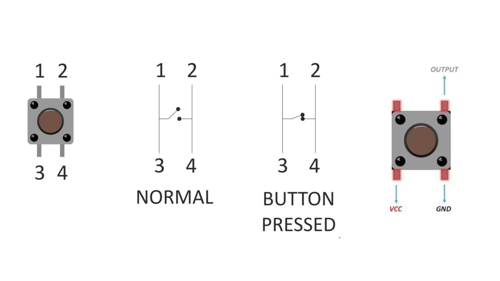

## SWITCH / PUSH BUTTON
A switch or push button is a simple yet essential electrical or electronic device used to control the flow of electric current in a circuit. It's designed to either allow or interrupt the electrical connection between two or more conducting points within the circuit.

A switch can be in either an open or closed position. In the open position, the circuit is broken, preventing the flow of electricity. In the closed position, the circuit is complete, allowing current to flow through, i.e. Closed Circuit 

    

Pin numbers 1-3 and 2-4 are internally connected when we press button 1-3, which gets connected to 2-4, thereby allowing a flow of current across an open-to-closed circuit configuration. 