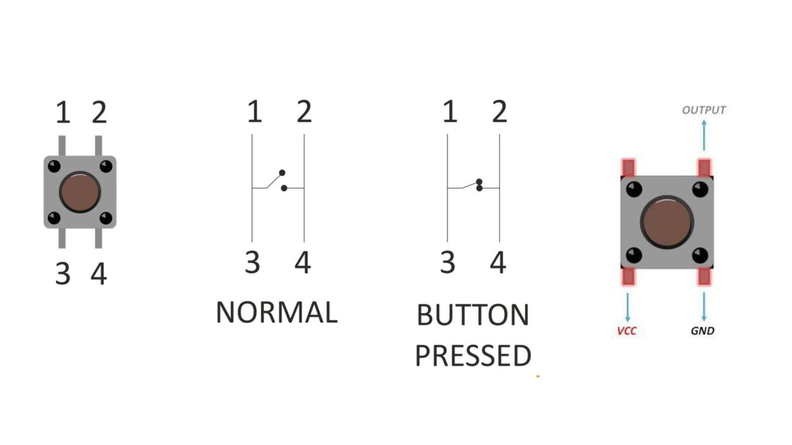

## Switch / Push Button

A switch or push button is a simple yet essential electrical or electronic device used to control the flow of electric current in a circuit. It's designed to either allow or interrupt the electrical connection between two or more conducting points within the circuit.

A switch can be in either an open or closed position. In the open position, the circuit is broken, preventing the flow of electricity. In the closed position, the circuit is complete, allowing current to flow through, (a closed circuit).

    

A push button usually has four legs. The legs on the same side (1 and 3, and also 2 and 4) are always connected to each other inside the button. When you press the button, the two pairs get connected together, so current can flow from one side to the other. When you release it, the connection breaks again.
