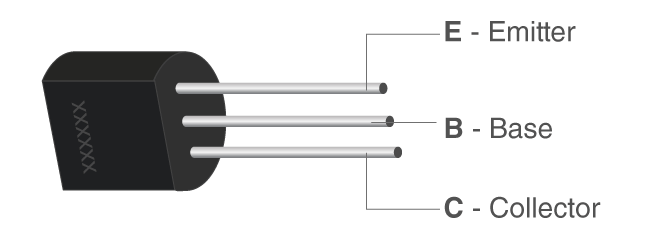
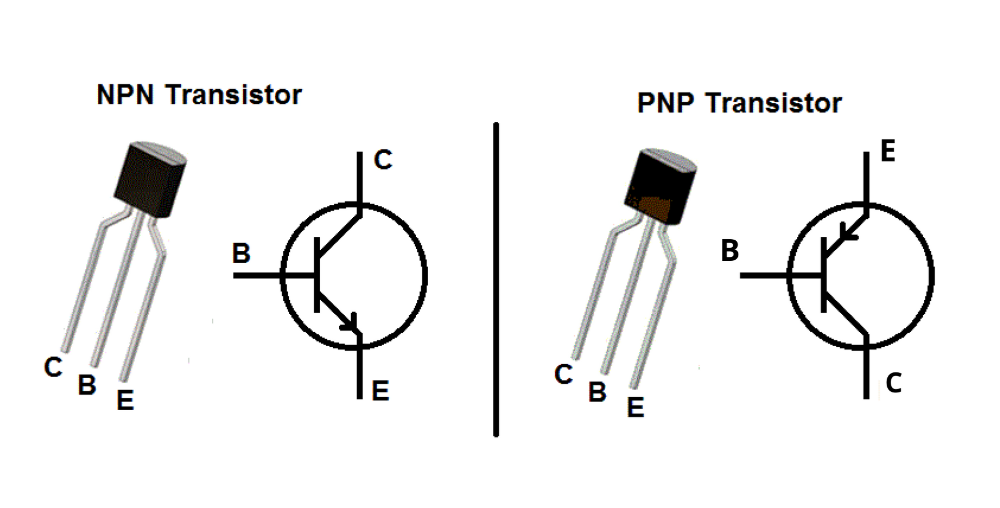
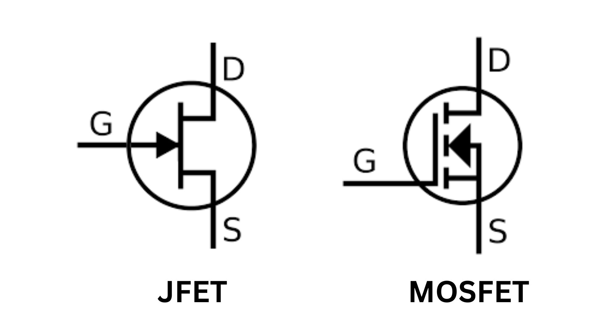

Transistors are tiny electronic components that play a crucial role in controlling the flow of electricity in electronic devices like computers and smartphones. They act as switches or amplifiers, helping us process information and perform tasks.The word "transistor" is a combination of "transfer" and "resistor," reflecting its ability to transfer electrical signals and control the flow of current. 

    

**Working:** The operation of a transistor involves the control of current flow between the two outer layers (collector and emitter) by a small current applied to the middle layer (base). This control mechanism allows transistors to amplify signals or act as electronic switches.

## Types of transistors that are widely used

**BJT (Bipolar Junction Transistor) and FET (Field-Effect Transistor)** are two fundamental types of transistors used in electronic circuits. They serve similar purposes but operate in slightly different ways.

### BJT (Bipolar Junction Transistor):

NPN and PNP - The Dynamic Duo: 

    

### NPN BJT:

**Structure:** It has three layers of semiconductor material, with the middle layer being very thin and acting as the base. 

**Operation:** When a small current is applied to the base terminal, it allows a larger current to flow from the collector to the emitter. In other words, it amplifies the current. It is like a faucet that controls the flow of water. 

### PNP BJT:

**Structure:** It also has three layers, but the arrangement of these layers is different. 

**Operation:** When a small current is applied to the base terminal, it blocks the flow of current from the collector to the emitter. It is like a valve that can be closed with a small effort.

BJTs are commonly used in analogue circuits, such as amplifiers, and in switching applications. 

### FET (Field-Effect Transistor):
There are two primary types of FETs: MOSFET and JFET. 

    

**MOSFET (Metal-Oxide-Semiconductor Field-Effect Transistor):**

**Structure:** It consists of a gate, source, and drain. There's a thin insulating layer between the gate and the channel. 

**Operation:** When you apply a voltage to the gate, it controls the flow of current between the source and drain.

There are two main types of MOSFETs: N-channel and P-channel. N-channel MOSFETs are typically used for switching applications, while P-channel MOSFETs are used when you need to invert the control logic.

**JFET (Junction Field-Effect Transistor):**

**Structure:**  It has a single, uninterrupted bar of semiconductor material. 

**Operation:** The flow of current between the source and drain is controlled by the voltage applied to the gate. JFETs are generally used for low-power amplification and switching.

