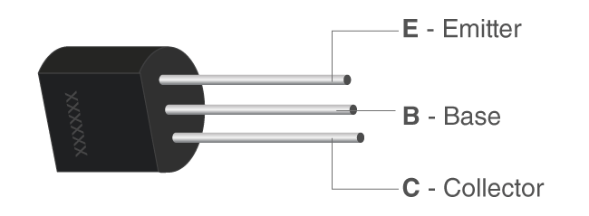
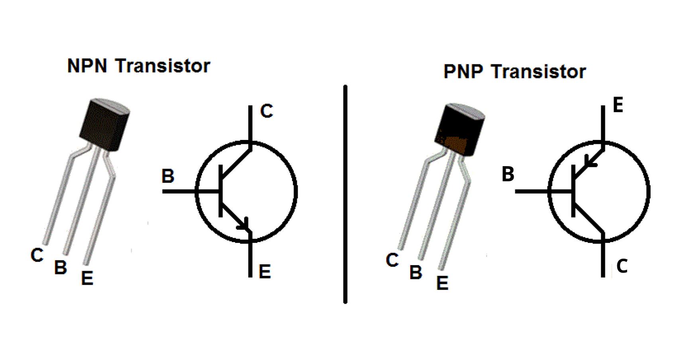
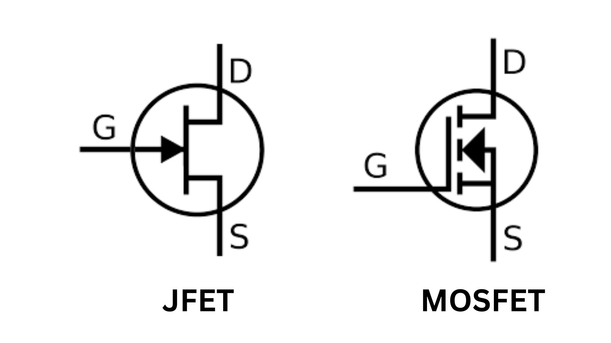

## Transistors

Transistors are tiny electronic components that play a crucial role in controlling the flow of electricity in electronic devices like computers and smartphones. They act as switches or amplifiers, helping us process information and perform tasks. The word "transistor" is a combination of "transfer" and "resistor," reflecting its ability to transfer electrical signals and control the flow of current. 

    

**Working:** The operation of a transistor involves the control of current flow between the two outer layers (the **collector** and the **emitter**) by a small current applied to the middle layer (the **base**). This control mechanism allows transistors to amplify signals or act as electronic switches.

## Types of transistors that are widely used

**BJT (Bipolar Junction Transistor) and FET (Field Effect Transistor)** are two fundamental types of transistors used in electronic circuits. They serve similar purposes but operate in slightly different ways.

### BJT (Bipolar Junction Transistor)

NPN and PNP the dynamic duo:

    

### NPN BJT

**Structure:** It has three layers of semiconductor material, with the middle layer being very thin and acting as the base. 

**Operation:** The three legs are the **base (B)**, **collector (C)** and **emitter (E)**. When a small current is sent into the base, a much larger current can flow from the collector to the emitter. In other words, it amplifies the current. It is like a faucet: a small turn of the handle controls a big flow of water. An NPN transistor turns **ON when the base is pulled high** (positive).

### PNP BJT

**Structure:** It also has three layers (base, collector, emitter), but the arrangement of the layers is the reverse of NPN. 

**Operation:** A PNP transistor works the opposite way round. It turns **ON when the base is pulled low** (towards ground), so current flows from the emitter to the collector. When the base is high, it is OFF.

BJTs are commonly used in analog circuits, such as amplifiers, and in switching applications. 

### FET (Field Effect Transistor)
There are two primary types of FETs: MOSFET and JFET. 

    

**MOSFET (Metal Oxide Semiconductor Field Effect Transistor):**

**Structure:** It consists of a gate, source, and drain. There's a thin insulating layer between the gate and the channel. 

**Operation:** When you apply a voltage to the gate, it controls the flow of current between the source and drain.

There are two main types of MOSFETs: N-channel and P-channel. N-channel MOSFETs are the most common choice for switching things on and off.

**JFET (Junction Field Effect Transistor):**

**Structure:** It has a single, uninterrupted bar of semiconductor material. 

**Operation:** The flow of current between the source and drain is controlled by the voltage applied to the gate. JFETs are generally used for low-power amplification and switching.

## Why a Robot Needs Transistors

An Arduino pin can only supply about 20 mA of current. A motor needs far more than that, so a pin cannot drive it directly. Trying to do so could damage the Arduino.

Instead, the Arduino pin sends a tiny signal to a transistor (or a motor driver chip, which has several transistors inside), and the transistor switches the larger motor current from the battery. The small signal controls the big current.
