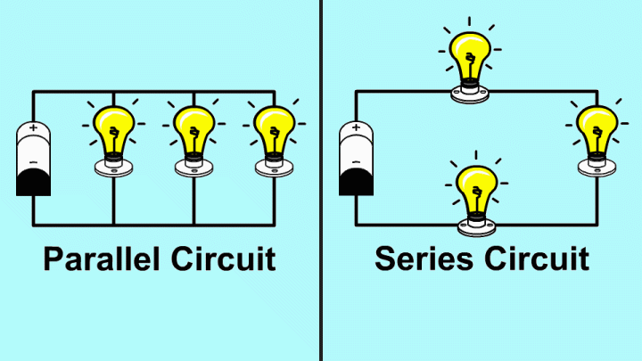

## Types of Electric Circuits: Based on the arrangement of the elements
- - -

Based on how components are connected we can classify circuits into Series and parallel circuits.
**Series circuit:**
- In a series circuit, components or devices are connected end-to-end, one after another, creating a single pathway for current to flow.
- Though different devices have different voltages across them, the same current flows through every device in the series circuit.
- If one component fails or is disconnected, the entire circuit is interrupted.

**Parallel Circuit:**
- In a parallel circuit, components are connected across common points, creating multiple pathways for current to flow.
- The voltage in every device across the circuit is exactly the same, but in general, different devices are going to see different currents.
- If one component fails or is disconnected, the rest of the circuit remains unaffected.

    

Did you notice how disconnecting one component affects different components in series and parallel connections? Now compare this with how disconnecting one component affects other components in your home, and guess which connection is used in your home.

> Note: do not play with live power sockets or plug points in your home — they carry higher voltage and current than our body can handle, and the risk of serious injury is high.

Let's look at the following table to understand the distribution of voltage and current in different arrangements of devices.

    

An electric circuit can be a combination of both series and parallel. The type of circuit depends on many factors, which include application, voltage or current requirements, and stability.