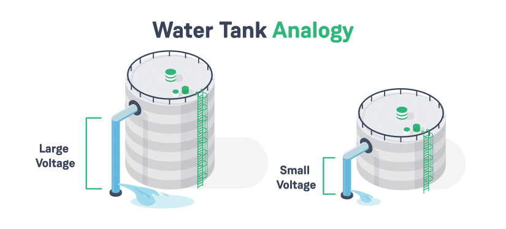

## What is the idea of voltage?

It is a fundamental electrical property representing the **electrical potential difference** between two points in a circuit.

Voltage is like the **"push"** that makes electricity flow. It's a measure of how much energy an electrical source has and how strongly it pushes electrons through a circuit.
A higher voltage corresponds to a more potent push.

> The unit of measurement for voltage is the volt (V).

**What is known as the potential difference?**
It refers to the *difference in voltage level* at two different points of the circuit. The potential difference is what causes electric charges to flow in a circuit.

**Let's take an analogy for more understanding:**

Consider the analogy of voltage to water flow in a tank. The height of the water level in the tank represents the potential difference or voltage.

    

The higher the water level, the greater the potential energy stored in the tank. Now, if you make a small hole at the bottom of the tank, water will flow out. The rate at which water flows out depends on the height of the water level. A higher water level (greater potential difference) will result in a stronger and faster flow, while a lower water level (lower potential difference) will lead to a slower and weaker flow.

