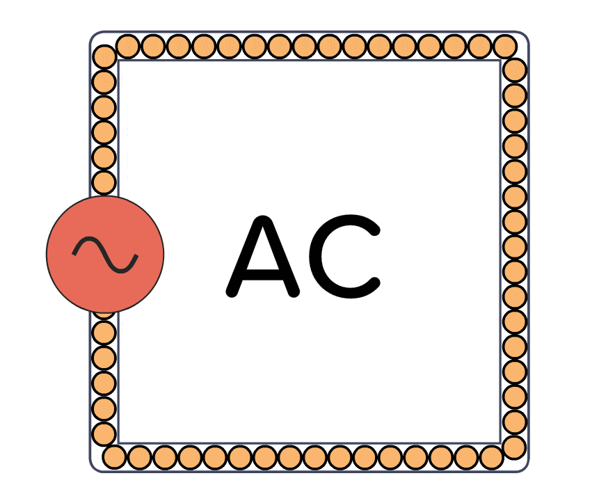
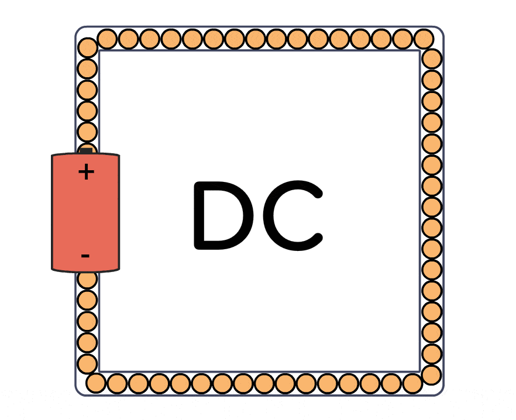

## What is current?

Electric current is the flow of electric charge through a conductive medium, such as a wire or a circuit.

*Electrons* are tiny particles that reside within a substance's molecular structure. These electrons are at times strongly held and sometimes loosely bound. When electrons are held loosely by the nucleus, they can flow freely inside the body's boundaries.

Since electrons are negatively charged particles, as they travel, a number of charges move with them, and this *movement of electrons* is referred to as *electric current*. The number of electrons that can travel determines a substance's capacity to conduct electricity.

> The unit of measurement for current is the ampere (A).

Some materials allow current to flow more freely than others. Materials are classified as conductors or insulators based on their capacity to carry electricity.

- - -

## Types of current

Current is classified into Direct current and Alternating current.

**Alternating Current(AC):**
- In an AC circuit, the direction of the electric current reverses periodically. This means that the flow of electrons changes direction back and forth many times per second.
- AC voltage and current levels change in a specific pattern over time.
- It starts from zero, rises to a peak value, then drops back to zero in the opposite direction, and finally returns to zero again.
- This repeating pattern is what allows AC to be easily transformed into different voltage levels for distribution and use.
- AC is the type of current that we typically use to power our homes, appliances, and most electronic devices.

    

**Direct Current(DC):**
- In a DC circuit, the electric current flows in one direction only. The flow of electrons remains constant and does not change direction, like in AC.
- DC is commonly used in batteries, electronic devices that have internal power sources, and certain applications where a stable and constant flow of current is required.
- DC voltage and current levels stay constant over time. This makes DC suitable for devices that need a steady and unchanging power supply, like most electronic gadgets such as cell phones, laptops, and flashlights.

    

- - -
**Graphical representation of AC and DC**

    

