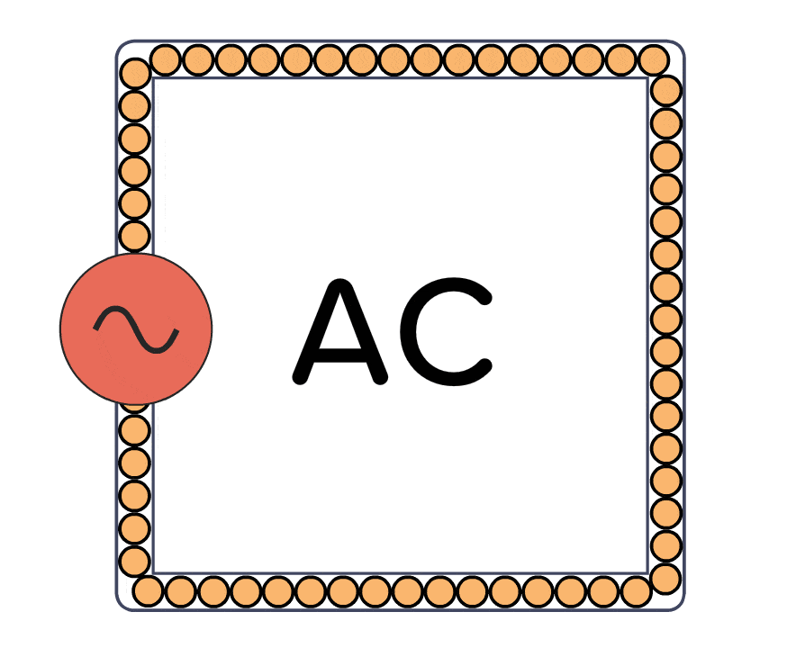
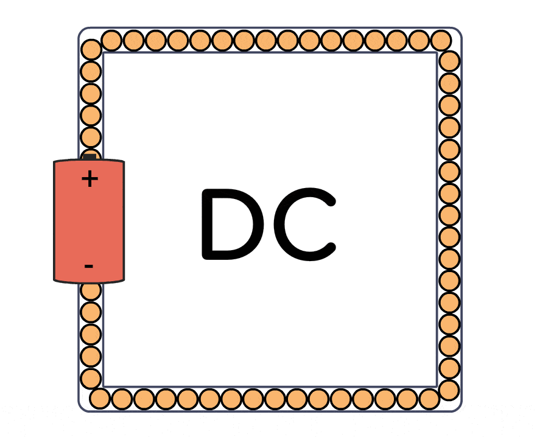

## What is current?

Electric current is the flow of electric charge (usually carried by electrons) through a conductive material, such as a wire.

*Electrons* are tiny particles found inside atoms. In some materials they are held tightly, and in others they are loosely held. Loosely held electrons can move freely through the material.

Electrons carry a negative charge, so when they move, charge moves with them. This *movement of charge* is called *electric current*. The more electrons that can move, the better the material conducts electricity.

> The unit of measurement for current is the ampere (A). One ampere means one coulomb of charge passing a point every second, so current is simply *charge per second*.

**Which way does current flow?** By convention, we draw current flowing from the positive (+) terminal to the negative (-) terminal. This is called *conventional current*. The electrons actually move the opposite way, from - to +. Don't let this confuse you: the convention was chosen before electrons were discovered, and circuit diagrams still use it.

Some materials allow current to flow more freely than others. Materials are classified as conductors or insulators based on their capacity to carry electricity.

> Try classifying different materials into conductors and insulators.

## Types of Current

Current is classified into alternating current and direct current.

**Alternating Current (AC):**
- In an AC circuit, the direction of the electric current reverses periodically. This means that the flow of electrons changes direction back and forth many times per second.
- AC voltage and current levels change in a specific pattern over time.
- It starts from zero, rises to a peak value, then drops back to zero in the opposite direction, and finally returns to zero again.
- This repeating pattern is what allows AC to be easily transformed into different voltage levels for distribution and use.
- AC is the type of current supplied to our homes by wall sockets. Many appliances run on it directly, while most electronics convert it to DC inside.

    

**Direct Current (DC):**
- In a DC circuit, the electric current flows in one direction only. The charge keeps moving the same way and does not reverse, unlike AC.
- DC is what batteries provide. It is also what electronic circuits (including your Arduino and robot) need.
- DC voltage and current levels stay constant over time. This makes DC suitable for devices that need a steady power supply, such as cell phones, laptops and flashlights (laptops and phone chargers convert AC to DC).

    

**Graph of AC and DC**

    

> **Try it:** Check the label on a battery or phone charger. Can you find the voltage and the current it gives?
