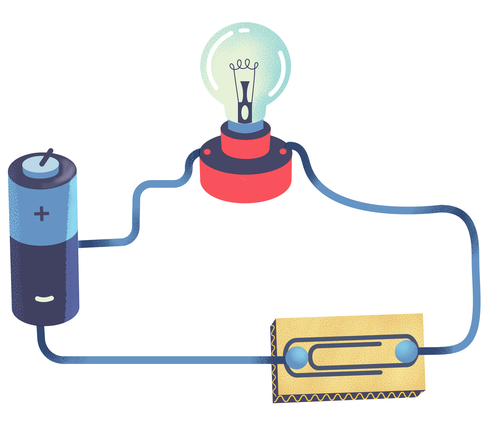

## What are Electric Circuits?
- - -

Hello, young adventurers! Have you ever wondered how turning on switch on one end of the room turns on light in the other end? Or how you toys light up as soon as you put on the battery and turn it on ? So the energy from battery/power source must be flowing through the light or toy, now let's see what makes the energy flow.

    

**A closed loop** or channel through which electric current passes is referred to as an electric circuit. It is made up of numerous components such as voltage sources, resistor, capacitors, inductors and switches, that are linked together via conductive wires.
- - -

    

### Open and close circuits
So if there's a close loop there's must a open loop right ?? And yes there An open loop circuit aswell.

An **Open circuit** is a circuit in which there is a break or interruption in the path that prevents electric current from flowing. 
    - In other words, the circuit is incomplete.
    - If a circuit is incomplete charges can't flow through the circuit.
    - So yes when you turn of the light buld you're just opening the circuit so the current cannnot flow through the circuit

A **Closed circuit** is a circuit where there is a conctinous and unbroken path for the electric current to flow.
    - In other words the circuit is complete.
    - If the circuit is complete the current flow through the circuit.
    - When you turn on the led or fan the you're basically closing the circuit and thus completing the circuit.
