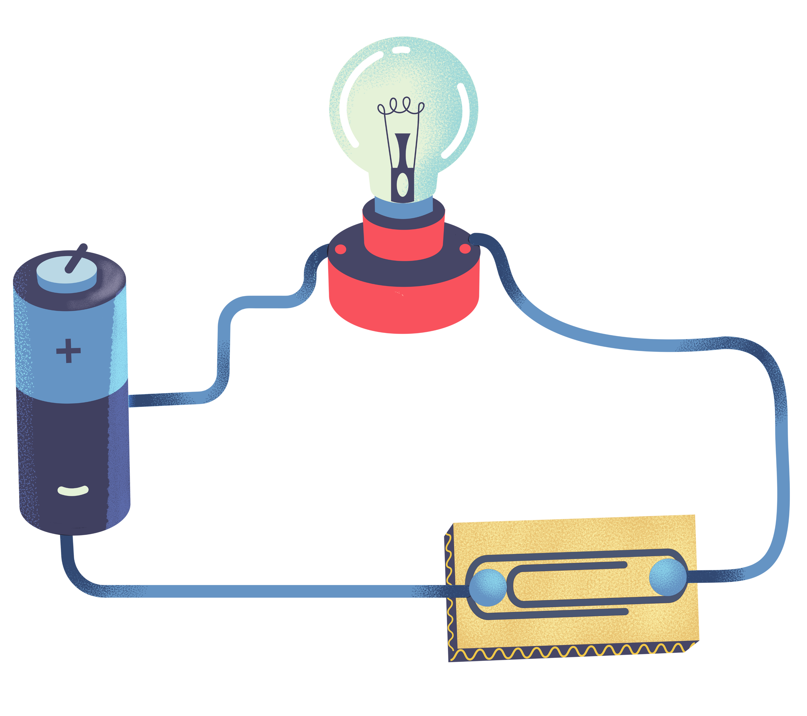

## What Are Electric Circuits?

Hello, young adventurers! Have you ever wondered how turning on a switch at one end of the room turns on a light on the wall? Or how your toys light up as soon as you put in the battery and turn it on? So it's natural to assume that the energy from the battery/power source must be flowing through the light or toy, now let's see what/how exactly the energy flows.

    

**A closed loop** or channel through which electric current passes is referred to as an electric circuit. It is made up of numerous components such as voltage sources, resistors, capacitors, inductors and switches, that are linked together via conductive wires.

### Open and Closed Circuits
So if there's a closed loop, there must be an open loop too, right?? And yes, there is an open loop circuit as well.

An **open circuit** is a circuit with a break in the path, so electric current cannot flow.

- In other words, the circuit is incomplete.
- If a circuit is incomplete, charges can't flow through it.
- When you turn off a light bulb, you are just opening the circuit so the current cannot flow through it.

A **closed circuit** is a circuit with a continuous, unbroken path for the electric current.

- In other words, the circuit is complete.
- If the circuit is complete, current flows through it.
- When you turn on an LED or a fan, you are closing the circuit and completing it.

    

