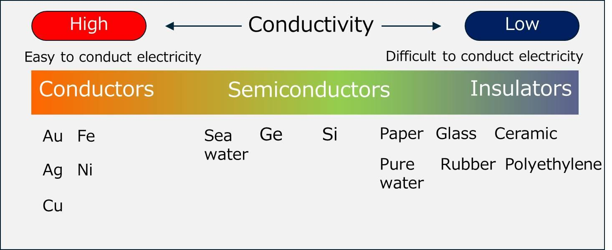
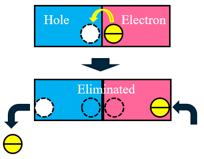

## What Are Semiconductors?

Materials can be sorted by how well they let electric current pass:

- **Conductors** (like copper and aluminum) let current flow easily.
- **Insulators** (like rubber, plastic and glass) almost completely block current.
- **Semiconductors** sit in between. They conduct a little, and we can control how much.

That "controllable" part is what makes semiconductors so special. It lets us build switches, amplifiers and chips.

    

**Examples of semiconductors**
- Silicon (Si)
- Germanium (Ge)
- Gallium Arsenide (GaAs)
- Gallium Nitride (GaN)

**Why silicon?** Silicon is the most popular one. It is found in ordinary sand, so it is cheap and plentiful. It also works well at normal room temperatures, and it is easy to turn into the tiny, precise parts that make up chips. Almost every chip in your phone, computer and Arduino is made of silicon.

Let's understand semiconductors with a video:

    <iframe
        width="100%"
        style="max-width:560px; aspect-ratio:16/9;"
        src="https://www.youtube.com/embed/YPFk-0CcWgI"
        title="YouTube video player"
        frameborder="0"
        allowfullscreen>
    </iframe>

## Electrons and Holes

- **Electrons** are tiny negatively charged particles. When they move, they carry current.
- A **hole** is a spot where an electron could be but isn't. Holes can move too, and they act like positive charge carriers.

    

**Theatre analogy:** Imagine a row of seats in a theatre with one empty seat. If the person next to the gap moves into it, the gap moves one seat the other way. The empty seat (the hole) seems to travel through the row, even though only people (electrons) moved.

## Making Semiconductors Useful: Doping

Pure silicon doesn't conduct very well. So engineers mix in tiny amounts of other elements. This is called **doping**. Silicon that has been doped is what real electronic devices are built on. There are two kinds:

**N-type (negative type):** Doped with an element like phosphorus, which brings in *extra electrons*. These extra electrons are free to move around and carry current.

**P-type (positive type):** Doped with an element like boron (or indium), which has *fewer* electrons than silicon. That leaves *holes*, like empty seats in the theatre, that electrons can hop into.

Do not worry: both types are still electrically neutral overall. Neither one is "charged". They just have different kinds of charge carriers available to move.

## The PN Junction

When a piece of p-type material is joined to a piece of n-type material, the joint is called a **PN junction**. It lets current flow easily in one direction but not the other. That is exactly what a **diode** is. Combining more such layers gives us **transistors**.
