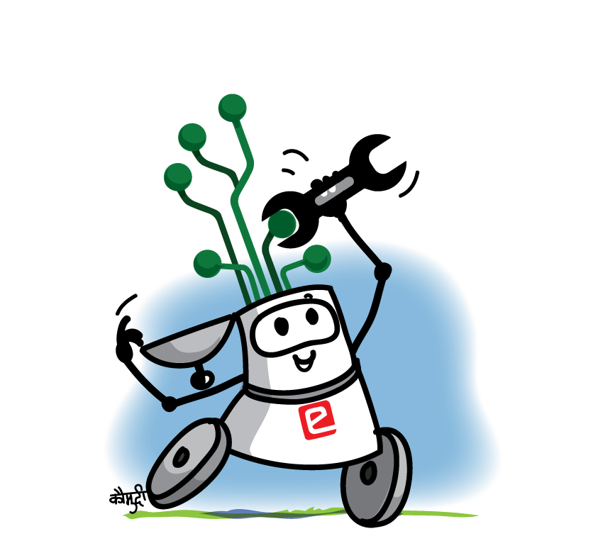

Hello there little explorers I hope you have gone through introduction to C++, now that we know about software shall we get our hands dirty with hardware !! Before we start building robots it's important to know the basics of electronics and micro controller. In this section we'll learn about:

- What are electronics circuits?
    - Types of circuits
    - Voltage
    - Current
    - Ohm's Law
    - Semiconductors
- Basic components of electric circuits
    - Breadboard and it's anatomy
    - Battery
    - Connecting Wires
    - Resistors
    - Capacitors
    - Diode
    - Transistors circuits and Embedded Systems

Don't worry about the sheer quantity of things to learn. You can understand these concepts in a blink of an eye. Understanding these concepts is the first step to bring out the young Tony stark Inside you so buckle up and get ready for the learn and build cool stuffs.

- - -
Let's dive into the first topic - [Electronic circuits](../Introductions%20to%20Electronics/What%20are%20Electric%20circuits?/index.md)
- - - 