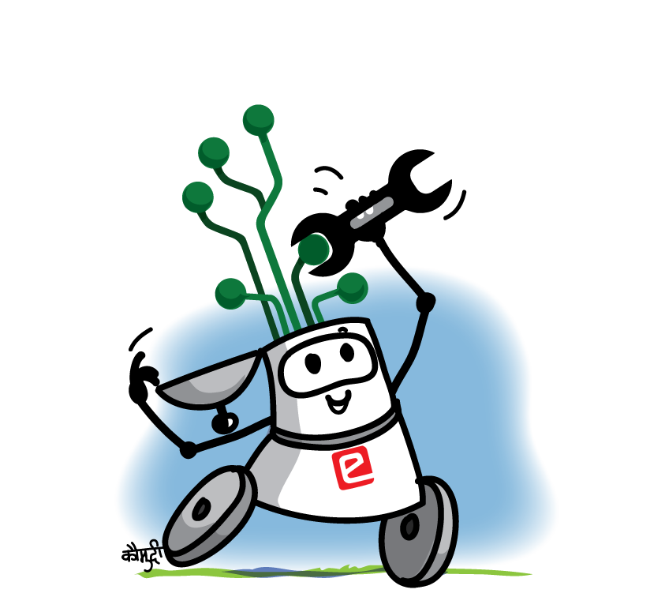

Hello there, little explorers! I hope you have gone through introduction to C++, now that we know about software shall we get our hands dirty with hardware! Before we start building robots it's important to know the basics of electronics and microcontrollers. In this section we'll learn about:

- What are electric circuits?
    - Types of circuits
    - Voltage
    - Current
    - Ohm's Law
    - Semiconductors
- Basic components of electric circuits
    - Breadboard and its anatomy
    - Battery
    - Switch
    - Resistors
    - Capacitors
    - Diodes
    - Transistors
    - Integrated circuits and embedded systems

Don't worry about the sheer quantity of things to learn. You can understand these concepts in a blink of an eye. Understanding these concepts is the first step to bring out the young Tony Stark inside you, so buckle up and get ready to learn and build cool stuff.

- - -
Let's dive into the first topic - [Electronic circuits](../Introductions%20to%20Electronics/What%20are%20Electric%20circuits/index.md)
- - - 