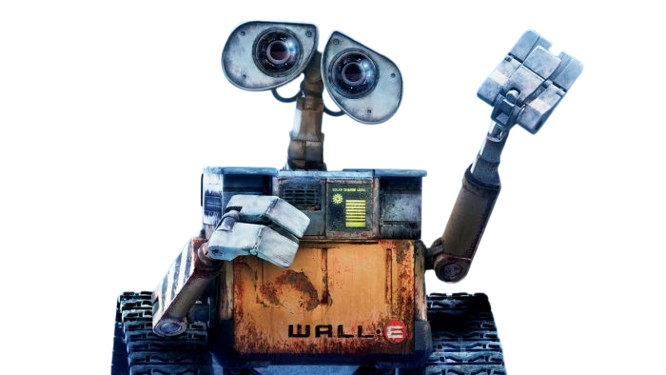

# Hello Little Explorers

Over the next few weeks you are going to build a robot that drives itself.
 
Not a remote-controlled car but a bot that looks at a black line on the floor with its own sensors, works out where the line went, and steers to stay on it. By the last task it will find its way through a maze, and then you will make the bot solve it.
 
You will start by learning to write code, and everything after that is built on top of it.

Now let's start with unerstanding how to code.