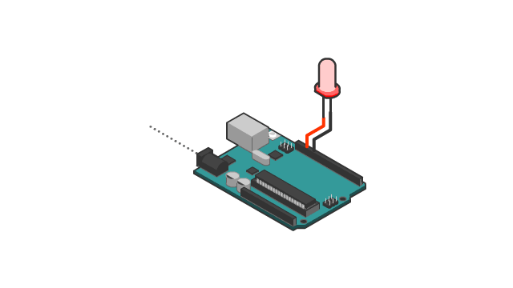

# Task 2: Introduction to Arduino

    

**Duration:** 1 week

## Brief

Hands-on with the Arduino Nano for the first time: [digital I/O](../../Learning/Introduction%20to%20a%20Microcontroller/Arduino%20Interfacing/LED.md), [analog I/O](../../Learning/Introduction%20to%20a%20Microcontroller/Arduino%20Interfacing/ADC.md), [Serial Communication](../../Learning/Introduction%20to%20a%20Microcontroller/Arduino%20Interfacing/Serial%20communication.md), and [PWM](../../Learning/Introduction%20to%20a%20Microcontroller/Arduino%20Interfacing/PWM.md) (including duty cycle).

Haven't been through Arduino Interfacing yet? Start with the [Velxio walkthrough](../../Learning/Introduction%20to%20a%20Microcontroller/Arduino%20Interfacing/index.md), then work through [LED](../../Learning/Introduction%20to%20a%20Microcontroller/Arduino%20Interfacing/LED.md), [Serial Communication](../../Learning/Introduction%20to%20a%20Microcontroller/Arduino%20Interfacing/Serial%20communication.md), and [PWM](../../Learning/Introduction%20to%20a%20Microcontroller/Arduino%20Interfacing/PWM.md) before attempting this task.
